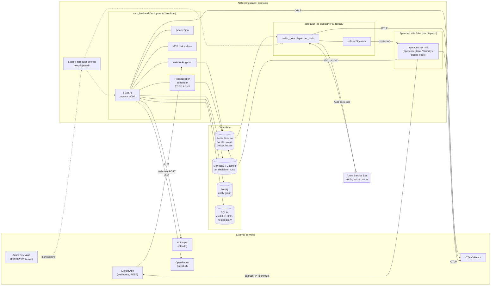
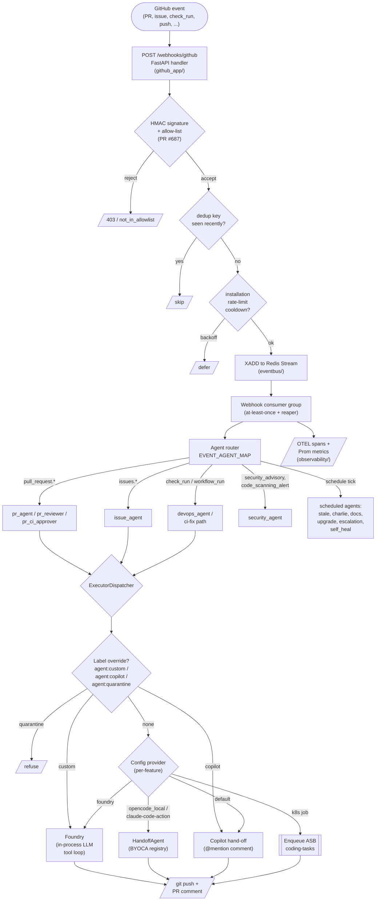
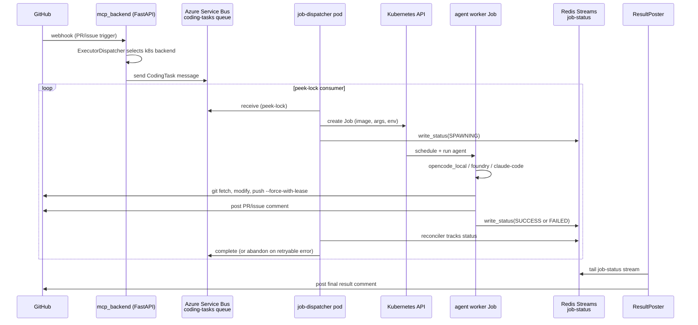

# Architecture

Caretaker is a multi-agent GitHub-automation system that runs on AKS. The
core split is unchanged: the orchestrator **decides**, coding backends
**author code**, GitHub **remembers**. What has grown is the surrounding
infrastructure — a webhook-driven control plane, a durable coding-job
pipeline on Azure Service Bus + Kubernetes, multiple coding-agent
backends, and a layered persistence story.

This page is the conceptual map. Source paths are cited inline so each
component can be verified.

## Deployable processes

| Process | Replicas | Entrypoint | Purpose |
|---|---|---|---|
| `mcp_backend` | 2 | [`uvicorn caretaker.mcp_backend.main:app`](https://github.com/ianlintner/caretaker/blob/main/src/caretaker/mcp_backend) | Webhook receiver, MCP tool surface, admin SPA, reconciliation scheduler |
| `caretaker-job-dispatcher` | 1 | [`python -m caretaker.coding_jobs.dispatcher_main`](https://github.com/ianlintner/caretaker/blob/main/src/caretaker/coding_jobs) | Azure Service Bus consumer, K8s Job spawner |
| Spawned coding-job pods | per dispatch | [`caretaker.k8s_worker`](https://github.com/ianlintner/caretaker/blob/main/src/caretaker/k8s_worker) | Per-task agent execution (opencode_local, foundry, claude-code) |
| `caretaker` CLI | local / CI | [`caretaker.cli`](https://github.com/ianlintner/caretaker/blob/main/src/caretaker/cli.py) | Standalone orchestrator for one-off runs and bootstrap |

The first two are deployed via Flux from
[`infra/k8s/caretaker-mcp-deployment.yaml`](https://github.com/ianlintner/caretaker/blob/main/infra/k8s/caretaker-mcp-deployment.yaml)
and
[`infra/k8s/caretaker-job-dispatcher-deployment.yaml`](https://github.com/ianlintner/caretaker/blob/main/infra/k8s/caretaker-job-dispatcher-deployment.yaml).
Both share the [`Dockerfile.mcp`](https://github.com/ianlintner/caretaker/blob/main/Dockerfile.mcp) image
(`gabby.azurecr.io/caretaker-mcp:latest`) with extras
`[admin,backend,otel,asb,k8s-worker]`. Secrets live in
`caretaker-secrets`, manually synced from Azure Key Vault
(`openclaw-kv-301919`).

## 1. Runtime topology

How the deployed pieces talk to each other and to the data plane.

Key invariants worth flagging:

- **Single-pod reconciliation**: the scheduler in
  [`caretaker.scheduler`](https://github.com/ianlintner/caretaker/blob/main/src/caretaker/scheduler) takes a Redis-backed
  lease so only one of the two `mcp_backend` replicas fans out tick work.
- **Single-pod dispatcher**: the `caretaker-job-dispatcher` Deployment is
  pinned to one replica; ASB peek-lock plus K8s Job idempotency keep
  duplicate dispatches from running.
- **GitHub is the source of truth** for PR/issue state; everything in the
  data plane is derived (decisions, runs, learned skills, entity graph).

## 2. Webhook event pipeline

What happens when a GitHub event arrives. Source of truth:
[`src/caretaker/github_app/`](https://github.com/ianlintner/caretaker/blob/main/src/caretaker/github_app),
[`src/caretaker/eventbus/`](https://github.com/ianlintner/caretaker/blob/main/src/caretaker/eventbus), and
[`ExecutorDispatcher`](https://github.com/ianlintner/caretaker/blob/main/src/caretaker/coding_agents).

The ExecutorDispatcher's selection order is:

1. **Label override** — `agent:custom`, `agent:copilot`, `agent:quarantine`
   take precedence over everything else.
2. **Per-feature config provider** — `.github/maintainer/config.yml`
   chooses `foundry`, `opencode_local`, `claude-code-action`, or
   `k8s-job` for a given feature (e.g. `pr_reviewer`, `ci_fix`).
3. **Copilot fallback** — preserves the legacy `@copilot` hand-off.

## 3. Coding-job lifecycle

The durable path introduced in
[#700](https://github.com/ianlintner/caretaker/pull/700). Used when a
coding task needs an isolated, longer-running execution environment than
the FastAPI request can provide — shells out to a per-task Kubernetes
Job.

Failure modes worth knowing:

- **Lock expiry**: ASB peek-lock duration must exceed worst-case Job
  scheduling latency, otherwise the message is redelivered while the
  Job is still running. Idempotency key on the K8s Job name guards
  against double-spawn.
- **Stuck Job**: the dispatcher's reconciler tracks SPAWNING entries in
  Redis and abandons the ASB message after a timeout so it retries.
- **No status emitted**: if a worker dies before writing terminal status,
  the next dispatcher tick reconciles from K8s Job state and posts a
  failure comment via `ResultPoster`.

## 4. Agent inventory

Eighteen agents under [`src/caretaker/`](https://github.com/ianlintner/caretaker/blob/main/src/caretaker), grouped by
how they are triggered.

```mermaid
flowchart LR
  subgraph EVT["Event-driven (webhook)"]
    PRAGENT["pr_agent<br/>monitor PRs, auto-merge"]
    PRREV["pr_reviewer<br/>LLM inline review"]
    PRCI["pr_ci_approver<br/>approve stuck bot CI"]
    ISA["issue_agent<br/>triage + dispatch"]
    DEPA["dependency_agent<br/>Dependabot PRs"]
    SECA["security_agent<br/>CodeQL, secret scan,<br/>Dependabot alerts"]
    DEVA["devops_agent<br/>main-branch CI"]
  end

  subgraph SCH["Scheduled (reconciliation tick)"]
    STALE["stale_agent<br/>close stale items"]
    CHAR["charlie_agent<br/>cleanup duplicates"]
    DOCS["docs_agent<br/>changelog reconcile"]
    UPG["upgrade_agent<br/>caretaker version bumps"]
    ESC["escalation_agent<br/>human digest"]
    SH["self_heal_agent<br/>backend self-diagnosis"]
  end

  subgraph DIS["Dispatch-time / advisory"]
    REV["review_agent<br/>grade runs/PRs"]
    PRIN["principal_agent<br/>architectural review"]
    REFA["refactor_agent"]
    PERF["perf_agent"]
    MIG["migration_agent<br/>upgrade impact"]
    TST["test_agent"]
    BOOT["bootstrap_agent<br/>scaffold new repos"]
  end

  WH(["GitHub webhook"]) --> EVT
  TICK(["scheduler tick<br/>(Redis lease)"]) --> SCH
  EVT -.->|"may invoke"| DIS
  SCH -.->|"may invoke"| DIS
```

For per-flow detail on the PR agent (10 sub-flows including triage,
readiness, CI fix, review, merge, cascade), see
[pr-flows-diagrams.md](pr-flows-diagrams.md).

## Data plane

| Store | What lives there | Module |
|---|---|---|
| **Redis Streams** | Webhook event bus, job-status stream, dedup keys, scheduler lease, fleet heartbeat, installation token cache | [`eventbus/`](https://github.com/ianlintner/caretaker/blob/main/src/caretaker/eventbus) |
| **MongoDB / Cosmos** | `pr_decisions` collection, archived runs (Cosmos-compatible queries — [#695](https://github.com/ianlintner/caretaker/pull/695)) | [`runs/`](https://github.com/ianlintner/caretaker/blob/main/src/caretaker/runs), [`state/`](https://github.com/ianlintner/caretaker/blob/main/src/caretaker/state) |
| **Neo4j** | Entity-relationship graph across PRs, issues, agents, decisions | [`graph/`](https://github.com/ianlintner/caretaker/blob/main/src/caretaker/graph) |
| **SQLite (in-pod)** | Evolution insight store (skills, reflections), fleet registry store | [`evolution/`](https://github.com/ianlintner/caretaker/blob/main/src/caretaker/evolution), [`fleet/`](https://github.com/ianlintner/caretaker/blob/main/src/caretaker/fleet) |
| **GitHub** | Authoritative PR / issue / comment / branch state | (implicit) |

## Cross-cutting layers

| Layer | Module | Responsibility |
|---|---|---|
| Observability | [`observability/`](https://github.com/ianlintner/caretaker/blob/main/src/caretaker/observability) | OTEL spans per agent, Prometheus RED middleware, cost tracking, PR-timeline metrics ([#685](https://github.com/ianlintner/caretaker/pull/685)) |
| Auth & Identity | [`auth/`](https://github.com/ianlintner/caretaker/blob/main/src/caretaker/auth), [`identity/`](https://github.com/ianlintner/caretaker/blob/main/src/caretaker/identity) | GitHub App JWT + installation tokens, OIDC for fleet & admin, OAuth2 service-to-service, bot-login classifier |
| Guardrails | [`guardrails/`](https://github.com/ianlintner/caretaker/blob/main/src/caretaker/guardrails) | Input sanitization (injection sigils, Unicode, byte budgets), output filtering, checkpoint-and-rollback for post-merge mutations |
| Evolution | [`evolution/`](https://github.com/ianlintner/caretaker/blob/main/src/caretaker/evolution) | Insight store, skill abstractions, reflection engine, strategy mutator, agent-file evolver, shadow-decision infrastructure |
| Evaluation | [`eval/`](https://github.com/ianlintner/caretaker/blob/main/src/caretaker/eval) | Offline harness over shadow-decision stream, Braintrust integration, nightly Prom gauges |
| Fleet registry | [`fleet/`](https://github.com/ianlintner/caretaker/blob/main/src/caretaker/fleet) | Opt-in heartbeat from consumer repos, allow-list ([#687](https://github.com/ianlintner/caretaker/pull/687)), global-skill promotion |
| Consensus & causal | [`consensus/`](https://github.com/ianlintner/caretaker/blob/main/src/caretaker/consensus), [`causal_chain.py`](https://github.com/ianlintner/caretaker/blob/main/src/caretaker/causal_chain.py) | Multi-agent consensus + causal-chain reconstruction for postmortems |

## External integrations

- **GitHub App** — webhook receiver, JWT signing, installation-token
  minting (cached in Redis), comment posting via short-lived tokens
  rather than `GITHUB_TOKEN` ([#693](https://github.com/ianlintner/caretaker/pull/693), [`58561a8`](https://github.com/ianlintner/caretaker/commit/58561a8)).
- **Anthropic / OpenRouter / LiteLLM** — provider abstraction in
  [`llm/`](https://github.com/ianlintner/caretaker/blob/main/src/caretaker/llm); per-feature model routing via
  `feature_models` config; `:online` suffix for web-grounded calls.
- **Azure Service Bus** — durable coding-task queue with peek-lock
  consumer pattern.
- **Azure Key Vault → caretaker-secrets** — manual sync workflow
  (see runbook in [`docs/observability.md`](observability.md)).
- **OpenTelemetry collector** — OTLP/gRPC from all three process types.
- **Braintrust** (optional) — shadow-decision evaluation; fail-open
  when SDK or API key absent.

## Why this design works

- **Stateless request path, durable job path** — webhook handlers stay
  fast (FastAPI handler does only enqueue + dedup + rate-limit); long
  work happens out-of-band in K8s Jobs.
- **Multiple coding backends behind one dispatcher** — Foundry,
  Copilot, opencode_local, and claude-code-action are
  hot-swappable per feature without touching agent code.
- **Narrow agent responsibilities** — each `*_agent/` package owns one
  concern; the orchestrator and ExecutorDispatcher are the only
  cross-cutting points.
- **GitHub remains the source of truth** — every other store is
  derivable from GitHub state, which keeps recovery and dogfooding
  cheap.

In short: **the orchestrator decides, coding backends do, GitHub
remembers.**
