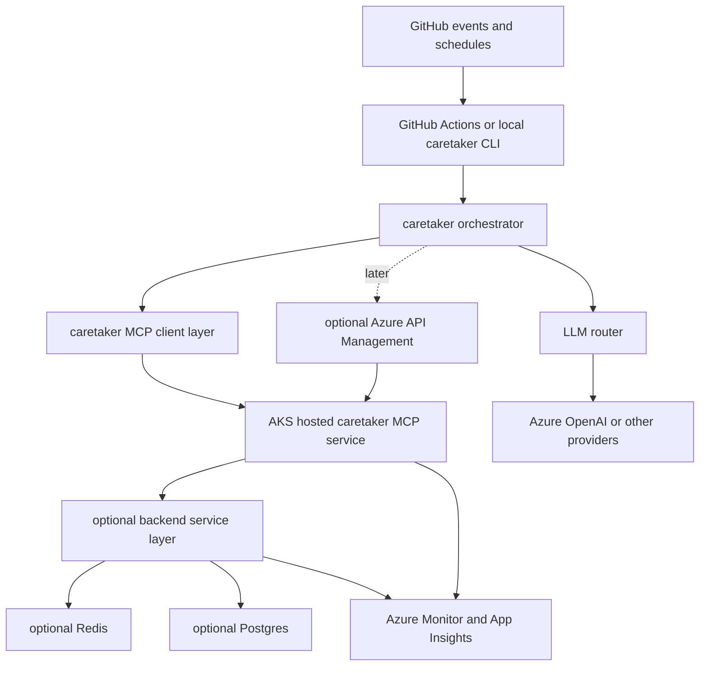

# Azure MCP architecture plan for caretaker

## Objective

This document recommends a low-cost, stable, backward-compatible Azure path for expanding caretaker with:

- Azure-hosted MCP servers
- lightweight backend services for agent support
- a governance layer for model and tool access
- optional future foundations for memory, vector, graph, observability, Redis, eventing, reporting, and additional LLM providers

The recommendation is intentionally conservative: start with the smallest change that fits caretaker's current architecture, preserve local and GitHub Actions execution, and add Azure-hosted capabilities as optional remote extensions instead of turning caretaker into a platform rewrite.

## Current caretaker architecture relevant to this decision

### Existing extension seams

Caretaker already has several strong integration points for Azure-hosted expansion.

1. The shared runtime contract in [`BaseAgent`](../src/caretaker/agent_protocol.py:44) and [`AgentContext`](../src/caretaker/agent_protocol.py:20) centralizes dependencies passed into agents. This is the cleanest place to introduce remote MCP clients, backend service clients, and future service registries.
2. The typed configuration model in [`MaintainerConfig`](../src/caretaker/config.py:209) already uses additive, backward-compatible sections. New Azure and MCP settings can follow the same pattern without breaking existing users.
3. The CLI entrypoint in [`run()`](../src/caretaker/cli.py:77) already supports mode-based execution and report output, which makes it straightforward to add remote service toggles, service health checks, or future MCP-specific commands.
4. The orchestrator in [`Orchestrator.__init__()`](../src/caretaker/orchestrator.py:68) already composes GitHub, LLM, state tracking, and memory services in one place. That makes it the natural composition root for optional Azure-hosted service clients.
5. The execution flow in [`Orchestrator.run()`](../src/caretaker/orchestrator.py:136) is sequential and deterministic, which favors a simple remote-call model over distributed coordination.
6. The local SQLite memory implementation in [`MemoryStore`](../src/caretaker/state/memory.py:40) gives caretaker a working baseline that can remain the default while Azure-hosted memory backends are introduced later behind the same logical abstraction.
7. The adapter and registry model in [`src/caretaker/agents.py`](../src/caretaker/agents.py) and [`AgentRegistry`](../src/caretaker/registry.py:15) means new remote-assisted capabilities do not require changing every agent at once.

### What this implies architecturally

Caretaker is currently:

- primarily a single-process Python orchestrator
- config-driven
- sequential rather than highly concurrent
- already able to operate with local state and external APIs
- not currently dependent on always-on backend infrastructure

That means the best Azure path is not a large control-plane migration. The best path is to keep the orchestrator model intact and add remote Azure services only where they clearly improve reach, governance, or durability.

## Design principles for Azure expansion

1. **Backward compatible first**: local-only and GitHub Actions workflows must remain viable.
2. **Use existing AKS only when it materially lowers incremental cost**: if the cluster already exists, deploying a small MCP service there can be nearly free from an incremental compute perspective.
3. **Prefer simple operational boundaries**: one MCP/backend deployment unit, one small set of supporting services, clear configuration toggles.
4. **Separate hosting from governance**: MCP servers can run on AKS or Azure Container Apps, while Azure API Management can be introduced later as a gateway when governance needs justify it.
5. **Treat advanced data systems as optional follow-on modules**: vector, graph, reporting, and event pipelines should not be phase-1 prerequisites.

## Azure hosting options for MCP servers and agent backends

### Option A: Host MCP and lightweight backend services on existing AKS

#### Shape

- deploy one small Python service for caretaker MCP endpoints
- optionally deploy one lightweight backend API for shared functions such as memory, task execution, or reporting jobs
- expose internally via ingress or service mesh
- optionally front with Azure API Management later

#### Pros

- best fit when an AKS cluster already exists and is operated reliably
- lowest incremental cost if spare cluster capacity already exists
- good OSS story because Kubernetes manifests and Helm charts are portable
- easy to colocate supporting services such as Redis, workers, or event consumers later
- strong scaling and isolation options if caretaker evolves beyond a single service

#### Cons

- highest operational complexity of the core hosting options if the cluster is not already mature
- requires cluster access model, namespaces, secrets, ingress, and rollout discipline
- can be too heavy if caretaker remains a small OSS utility with modest traffic

#### Best use

- existing AKS footprint is available
- platform team already understands AKS
- caretaker needs a stable long-lived internal endpoint and room for follow-on services

### Option B: Host MCP and lightweight backend services on Azure Container Apps

#### Shape

- deploy one or more containerized Python services
- use HTTP ingress for MCP or backend APIs
- scale to zero where supported and appropriate
- attach managed identity, secrets, and optional revisions

#### Pros

- much lower operational complexity than AKS
- good developer ergonomics for small services
- good Azure-native stability for lightweight APIs and workers
- easier to justify when caretaker usage is bursty or small

#### Cons

- if AKS already exists, Container Apps may create duplicate operational surfaces rather than reusing sunk infrastructure
- less portable than pure Kubernetes-based packaging
- certain advanced network and platform patterns are less flexible than AKS

#### Best use

- no strong reason to reuse AKS
- caretaker remains a small service footprint
- team wants managed runtime behavior over platform control

### Option C: Use Azure API Management as AI and MCP gateway

#### Shape

- MCP servers and backend APIs still run somewhere else, usually AKS or Container Apps
- Azure API Management becomes the front door for:
  - authentication and authorization
  - rate limiting
  - telemetry
  - request normalization
  - model routing
  - policy enforcement
  - gateway abstraction for multiple LLM providers

#### Pros

- strongest governance option for AI and MCP access
- excellent future home for token controls, caching, backend routing, and provider abstraction
- useful once caretaker needs stable public or shared internal service contracts
- good security and observability policy layer

#### Cons

- not a hosting platform by itself
- adds cost and operational surface that may be unnecessary at phase 1
- easy to overbuild if there is only one small internal service

#### Best use

- multiple clients or repos will call the same caretaker MCP/backend services
- model governance matters
- externalized API contracts become important
- extra LLM providers need a common policy plane

### Lightweight supporting services to consider

These should be optional, not mandatory, in the first iteration.

#### Azure Cache for Redis

Use for:

- distributed locks when multiple caretaker workers may overlap
- short-lived queue-like coordination
- deduplication keys and cooldowns
- caching expensive remote responses

Do not require it for phase 1 because caretaker currently works with local memory and sequential execution.

#### Azure Service Bus or Event Grid

Use for:

- decoupled async workflows
- webhook fan-out
- background job dispatch
- durable retries

Do not require it initially unless caretaker shifts from scheduled execution to multi-service event processing.

#### Azure Database for PostgreSQL

Use for:

- durable relational state beyond current GitHub and SQLite persistence
- reporting metadata
- multi-tenant service metadata
- audit tables

This is a better general-purpose long-term system of record than inventing too much state inside Redis.

#### Azure AI Search or vector-capable storage

Use later for:

- semantic memory
- knowledge retrieval across issues, PRs, CI failures, and historical run artifacts

This should follow a clear retrieval use case, not precede one.

#### Microsoft Fabric, Power BI, or simple exported reports

For reporting, start with exported JSON and markdown artifacts. Only add a managed analytics/reporting stack if there is a real audience and recurring review workflow.

## Tradeoff analysis

| Option | Cost | Operational complexity | Scalability | Security and governance | OSS friendliness | Stability |
| --- | --- | --- | --- | --- | --- | --- |
| Existing AKS | Lowest incremental cost if cluster already paid for | Highest | Highest ceiling | Strong, depends on cluster standards | Strong, portable manifests | Strong if cluster already stable |
| Azure Container Apps | Low to moderate | Low | Good for small to medium services | Good built-in Azure controls | Moderate | Strong |
| Azure API Management gateway in front of hosting | Added fixed cost on top of hosting | Moderate | High at gateway layer | Best governance option | Moderate | Strong |

### Detailed reading of the tradeoffs

#### Cost

- **Best incremental cost with existing AKS** if caretaker can reuse spare capacity, existing ingress, and shared observability.
- **Best standalone simplicity-to-cost ratio with Container Apps** when there is no desire to depend on AKS.
- **APIM should usually be deferred** until there is enough shared API traffic, governance need, or provider multiplexing to justify it.

#### Operational complexity

- **AKS** wins when the platform already exists, but loses badly if caretaker would have to create cluster operational burden by itself.
- **Container Apps** is the simplest managed runtime for small remote services.
- **APIM** is valuable but should be introduced when its policy surface solves real problems, not speculative ones.

#### Scalability

- **AKS** has the most flexibility for mixed workloads, background workers, sidecars, and data plane expansion.
- **Container Apps** is sufficient for early caretaker MCP and backend APIs.
- **APIM** improves control and client-facing scalability patterns, but depends on backend hosting.

#### Security

- **APIM** is the strongest governance layer for MCP and LLM traffic.
- **AKS** and **Container Apps** both support managed identity and private networking; AKS offers more control but requires more work.

#### OSS friendliness

- **AKS with Kubernetes manifests or Helm** is the most open and portable packaging model.
- **Container Apps** is still reasonable, but more Azure-shaped.
- **APIM** is the least OSS-portable piece, so it should stay optional until justified.

#### Stability

- **Existing mature AKS** is excellent when already operated well.
- **Container Apps** is also very stable for smaller service footprints.
- The biggest instability risk is not the platform choice itself; it is introducing too many new services at once.

## Recommended architecture for caretaker

### Recommendation summary

Use **existing AKS as the primary hosting target for a small caretaker MCP and backend service**, keep **Azure API Management optional and deferred**, and keep **Redis, eventing, vector, graph, and reporting services out of phase 1 unless a concrete need appears**.

This is the best low-cost stable path because the user explicitly wants to reuse existing Kubernetes infrastructure when practical, and caretaker's current architecture does not need a broad distributed redesign.

### Recommended target architecture

### Why this is the right fit for caretaker

1. Caretaker remains centered on the orchestrator and agent model in [`Orchestrator`](../src/caretaker/orchestrator.py:65), rather than moving decision logic into a new service plane.
2. Remote MCP capabilities become additive. Agents can call remote tools through a client abstraction while preserving existing local logic.
3. The current memory model in [`MemoryStore`](../src/caretaker/state/memory.py:40) can stay the default, allowing Azure-hosted memory evolution later without a forced migration.
4. The configuration model in [`MaintainerConfig`](../src/caretaker/config.py:209) is already ready for additive sections such as `azure`, `mcp`, `redis`, `telemetry`, and `providers`.
5. Existing AKS capacity gives the cheapest practical always-on home for shared caretaker capabilities.

### What phase 1 should include

- one AKS-hosted caretaker MCP service
- one minimal backend service only if MCP alone is insufficient
- Azure Monitor and Application Insights instrumentation
- managed identity and secret/config integration
- additive config in caretaker for remote MCP endpoint discovery and feature flags

### What phase 1 should explicitly avoid

- mandatory Redis
- mandatory event bus
- mandatory APIM
- mandatory vector database
- mandatory graph database
- mandatory reporting stack
- rewriting all agents to be service-native

## Alternative architectures and when to choose them

### Alternative 1: Azure Container Apps first

Choose this if:

- the existing AKS cluster is hard to access politically or operationally
- the caretaker service footprint stays very small
- the team wants the fastest managed path with the least cluster-specific work

This is the best fallback if AKS reuse turns out to be expensive in practice despite nominal availability.

### Alternative 2: AKS plus Azure API Management from the start

Choose this if:

- multiple consumers will call caretaker MCP services early
- governance, rate limiting, and provider abstraction are immediate requirements
- the project wants a stable external API surface from day one

This is stronger for multi-client shared services, but heavier than needed for a first OSS-focused increment.

### Alternative 3: Local-first caretaker with no always-on backend yet

Choose this if:

- the team wants to define the MCP contract before choosing hosting
- there is no immediate workload that requires always-on remote tools
- project bandwidth strongly favors delaying cloud spend and ops

This can still be valid, but it does not satisfy the current desire to research and establish an Azure-hosted path forward.

## Specific integration points with the current codebase

### 1. Configuration additions

Extend [`MaintainerConfig`](../src/caretaker/config.py:209) with additive sections, for example:

- `azure`
- `mcp`
- `telemetry`
- `redis`
- `providers`

Recommended initial settings shape:

- `mcp.enabled`
- `mcp.endpoint`
- `mcp.auth_mode`
- `mcp.timeout_seconds`
- `mcp.allowed_tools`
- `azure.use_managed_identity`
- `telemetry.enabled`
- `telemetry.application_insights_connection_string_env`

This follows the existing strict typed model used across agent configs in [`src/caretaker/config.py`](../src/caretaker/config.py).

### 2. Orchestrator composition root

Wire remote service clients in [`Orchestrator.__init__()`](../src/caretaker/orchestrator.py:68).

Recommended responsibilities there:

- construct an MCP client registry if configured
- construct a backend service client if configured
- pass those through [`AgentContext`](../src/caretaker/agent_protocol.py:20) or a closely related context object
- keep all of it optional so existing flows still work unchanged

### 3. Agent context and capability injection

[`AgentContext`](../src/caretaker/agent_protocol.py:20) is the best place to add optional handles such as:

- `mcp_client`
- `service_registry`
- `telemetry`

This preserves the current agent contract and keeps agent evolution incremental.

### 4. LLM provider abstraction

[`LLMRouter`](../src/caretaker/llm/router.py:24) already acts as a provider decision point. That makes it the natural place to later support:

- Azure OpenAI
- APIM-fronted model endpoints
- other external providers under policy control

The key design recommendation is to avoid coupling provider selection directly into every agent.

### 5. Memory abstraction evolution

[`MemoryStore`](../src/caretaker/state/memory.py:40) should remain the baseline implementation, but caretaker should plan for a storage abstraction that allows:

- local SQLite as default
- Redis for short-lived shared coordination
- Postgres for durable service-backed state
- vector storage for semantic retrieval only when needed

The first step is an interface boundary, not a migration.

### 6. Registry and feature rollout

Because agent execution is already centralized in [`AgentRegistry.run_all()`](../src/caretaker/registry.py:64), rollout can be staged agent by agent:

- keep existing agents unchanged by default
- enable remote MCP use for one agent or tool path first
- expand only after observability confirms value

## Guidance on the areas of interest without letting scope explode

### MCP path forward

Make MCP the first remote extension mechanism, but keep it focused on a small number of high-value tools. Do not make every caretaker function an MCP service immediately.

### Memory, vector, and graph

- **Memory**: keep local SQLite default now, design abstraction next.
- **Vector**: add only after there is a defined retrieval scenario such as PR precedent search or CI fix recall.
- **Graph**: defer until there is a real relationship-heavy query problem. Most near-term caretaker needs will be satisfied by structured state plus optional search.

### Observability and telemetry

This is worth doing early. Add telemetry before adding many distributed components. Prioritize:

- request success and latency for MCP/backend calls
- tool invocation counts
- model invocation counts and errors
- per-agent remote dependency metrics

### Redis for blocking, locks, and queues

Use Redis only when caretaker has overlapping workers or shared mutable state across runtimes. Until then, it is optional.

### Eventing

Use eventing only when a concrete async workflow emerges, such as backlog processing, report generation, or webhook fan-out. Avoid introducing a bus just to appear cloud-native.

### MCPs for other services

Support this later through a small service registry and configuration-driven discovery. Do not hardwire many external MCP providers into phase 1.

### Databases

If a shared backend needs durable state beyond GitHub and local files, prefer Postgres over ad hoc new stores.

### Reporting

Start with markdown and JSON artifacts plus Application Insights dashboards. Add a reporting database or BI layer only after consumers and use cases are established.

### Additional LLM access

Add through the existing router abstraction in [`LLMRouter`](../src/caretaker/llm/router.py:24). If provider count grows or governance becomes necessary, place APIM in front of model endpoints.

## Phased implementation plan

### Phase 0: Define the extension seam without changing behavior

Goals:

- preserve current local and GitHub Actions behavior
- define additive config and runtime abstractions
- identify one or two pilot remote tool flows

Deliverables:

- typed config sections for Azure and MCP
- optional MCP client abstraction
- optional telemetry abstraction
- documentation for local-only versus Azure-enabled modes

### Phase 1: Simple proven path on existing AKS

Goals:

- deploy one caretaker MCP service to existing AKS
- integrate one narrow caretaker remote capability
- instrument remote calls and failures

Recommended scope:

- a small Python service exposing caretaker MCP tools
- managed identity or another Azure-compatible auth path
- Application Insights and Azure Monitor integration
- no APIM requirement yet
- no Redis requirement yet

Success criteria:

- local caretaker still works with remote features disabled
- Azure-enabled caretaker can call the AKS-hosted MCP endpoint reliably
- failures degrade gracefully without breaking core orchestrator flows

### Phase 2: Operational hardening and shared service features

Add only if phase 1 proves useful.

Potential additions:

- optional Redis for locks, cooldown sharing, and cache
- optional background worker pattern
- optional lightweight backend API for jobs or reports
- stronger secret rotation and service health probes
- per-tool authorization and rate limiting

### Phase 3: Governance and provider abstraction

Potential additions:

- Azure API Management in front of MCP and model endpoints
- token and request controls
- model routing and provider abstraction
- standardized auth and telemetry policies

Choose this phase when caretaker becomes a shared service surface rather than a single-project extension.

### Phase 4: Advanced memory and analytics only when justified

Potential additions:

- vector-backed retrieval for precedent and semantic memory
- Postgres-backed reporting and trend storage
- event-driven processing where asynchronous workflows clearly pay off
- graph capabilities only if relationship traversal becomes central

## Explicit notes on manifests, scripts, and backend scaffolding to implement next

These are the concrete next artifacts this architecture suggests.

### Kubernetes manifests or packaging

Implement next:

- `k8s/caretaker-mcp-deployment.yaml` or Helm chart equivalent
- `k8s/caretaker-mcp-service.yaml`
- `k8s/caretaker-mcp-ingress.yaml` if ingress is needed
- namespace, secret, and config map templates
- health probes and resource requests sized for a very small service footprint

If the repo prefers Helm, package these as a small chart rather than raw manifests.

### Backend service scaffolding

Implement next:

- `src/caretaker/mcp/` package for client abstractions and capability discovery
- `src/caretaker/services/` package for optional remote backend clients
- a small separate backend service project only if the MCP server alone is insufficient

Recommended first backend capabilities:

- health endpoint
- tool registry endpoint or MCP capability exposure
- optional durable task execution endpoint only if needed

### Configuration and environment scaffolding

Implement next:

- config schema additions under [`schema/config.v1.schema.json`](../schema/config.v1.schema.json)
- environment-variable naming conventions for endpoint URLs, auth mode, and telemetry settings
- examples in [`docs/configuration.md`](./configuration.md)

### Scripts and developer workflows

Implement next:

- local script or task runner target to run caretaker against a local MCP endpoint
- build and image publish scripts for the MCP service container
- AKS deployment scripts or GitHub Actions workflow for manifest or Helm deployment
- smoke-test script that validates MCP health and one sample tool call

### Observability scaffolding

Implement next:

- App Insights instrumentation for the remote service
- correlation IDs propagated from caretaker runs into remote calls
- dashboards for request rate, errors, latency, and tool usage

## Decision summary

For caretaker, the best low-cost stable path is:

1. keep the current Python orchestrator and agent model intact
2. add optional Azure and MCP configuration surfaces
3. deploy a small caretaker MCP service onto the existing AKS cluster
4. instrument it well
5. defer Azure API Management, Redis, eventing, vector, graph, and reporting systems until concrete needs emerge

This path gives caretaker a real Azure-hosted expansion story without converting the project into a broad platform migration before it earns that complexity.

## Proposed next implementation checklist

- add typed Azure and MCP config sections to [`src/caretaker/config.py`](../src/caretaker/config.py)
- extend [`AgentContext`](../src/caretaker/agent_protocol.py:20) with optional remote capability handles
- compose optional MCP and telemetry clients in [`Orchestrator.__init__()`](../src/caretaker/orchestrator.py:68)
- create initial `src/caretaker/mcp/` scaffolding for client and capability abstractions
- add AKS deployment packaging for a minimal caretaker MCP service
- add observability instrumentation before broadening remote feature use
