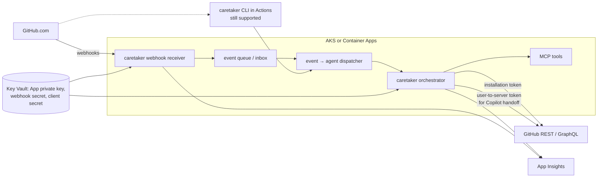

# GitHub App architecture plan for caretaker

## Objective

This document analyzes whether caretaker should be distributed and operated as a
**GitHub App** instead of (or alongside) the current model of a Python
orchestrator run from a GitHub Actions workflow plus a `COPILOT_PAT` belonging
to a real user.

The motivating observation: GitHub Apps have a native concept of
**delegated / user-to-server tokens**, short-lived installation tokens, and
per-install rate limits, all of which directly address the rough edges that
`COPILOT_PAT` introduces today.

This plan is intentionally conservative and backward compatible, in the same
style as [`docs/azure-mcp-architecture-plan.md`](./azure-mcp-architecture-plan.md):
start with the smallest useful change, preserve local and GitHub Actions
execution, and let the App become a capability, not a rewrite.

---

## 1. Motivation

### 1.1 Why this question came up

The current setup ([README](../README.md), [`architecture.md`](./architecture.md))
requires each consumer repo to:

1. Add a `maintainer.yml` workflow.
2. Provide a `COPILOT_PAT` secret owned by a real (or machine) user with
   write access and a Copilot seat.
3. Optionally provide `ANTHROPIC_API_KEY`.

That PAT exists for two specific reasons in
[`src/caretaker/github_client/api.py`](../src/caretaker/github_client/api.py):

- The Copilot coding-agent assignment flow requires a user-identity token.
- Copilot only reacts to `@copilot` mentions coming from a real user / PAT
  identity, not from `github-actions[bot]`.

The PAT model has accumulating costs:

- **Rotation pain:** PATs expire; every consumer repo feels it at once.
- **Over-scoped access:** a fine-grained PAT still mirrors one human's
  surface area.
- **Attribution ambiguity:** automated actions appear to come from a user
  or `github-actions[bot]` rather than a dedicated bot.
- **Shared rate limits:** every repo using the same PAT shares one 5000/hr
  budget.
- **No push events:** caretaker polls on schedule; it cannot react in
  real time to a failing CI run or a new security alert.
- **Manual fleet install:** each repo must paste the setup issue, merge
  the PR, and wire the secret.

### 1.2 What "delegated calls" buys us

GitHub Apps support two complementary authentication flows:

- **Server-to-server** via an **installation token** (acts as
  `caretaker[bot]`).
- **User-to-server** via OAuth (acts **on behalf of** a signed-in user who
  authorized the app).

User-to-server tokens are the principled way to do things that must be
attributed to a specific human — for example the exact actions that today
force `COPILOT_PAT` to exist.

---

## 2. Current-state audit

Places that assume a user-identity token today, based on the code:

| Call site | What it needs user identity for |
|---|---|
| [`GitHubClient.__init__`](../src/caretaker/github_client/api.py) accepts both `token` and `copilot_token` | Two-token model hard-wired at construction |
| [`GitHubClient.assign_copilot_to_issue`](../src/caretaker/github_client/api.py) | Copilot SWE agent assignment (suggested-actors flow) |
| [`GitHubClient.create_issue` + `update_issue`](../src/caretaker/github_client/api.py) | Detect `copilot` assignees and hand off to the Copilot flow using `copilot_token` |
| [`GitHubIssueTools`](../src/caretaker/tools/github.py) | `default_copilot_assignment()` + `assign_copilot()` pass-throughs |
| [`Orchestrator.from_github_env`](../src/caretaker/orchestrator.py) | Reads both `GITHUB_TOKEN` and `COPILOT_PAT` from env |
| `issue_agent/dispatcher.py`, `devops_agent/agent.py`, `security_agent/agent.py`, `self_heal_agent/agent.py`, `dependency_agent/agent.py`, `docs_agent/agent.py`, `upgrade_agent/planner.py` | All call `assignees=["copilot"]` plus `copilot_assignment=...` |
| Comments that `@copilot` must see | Posted via `use_copilot_token=True` path |

Everything else — labels, PR reads, merges, reviews, check runs, CI logs —
works fine with a less-privileged token, i.e. with an App installation
token.

**Consequence:** only Copilot hand-off is tightly coupled to a user
identity. The rest of caretaker would work under a pure installation
token today.

---

## 3. GitHub App model in one page

### Identity
- App has a unique ID and a private key.
- Users / orgs **install** the App, which creates an installation.
- Per installation, caretaker can mint:
  - a **JWT** (from the private key) → used to request…
  - an **installation token** (short-lived, ~1h).
- Users can additionally authorize the app with OAuth → a
  **user-to-server token** tied to that user's permissions.

### Permissions
- Declared statically in the app manifest
  (e.g. `issues: write`, `contents: read`, `pull_requests: write`,
  `checks: read`, `metadata: read`, `actions: read`,
  `security_events: read`).
- Installers see and approve them — much better security story than a
  PAT.

### Events
- Apps subscribe to webhook events on install.
  (`pull_request`, `issues`, `issue_comment`, `check_run`,
  `workflow_run`, `push`, `code_scanning_alert`,
  `dependabot_alert`, `secret_scanning_alert`, etc.)
- Delivered over HTTPS to a webhook URL with HMAC signature.

### Rate limits
- 5000 req/hr **per installation**, scaling up to ~12.5k/hr for larger
  installs — a dramatic improvement over a single shared PAT budget.

### Hosting requirement
- Apps require a **publicly reachable HTTPS endpoint** to receive
  webhooks. There is no equivalent of the Actions-only runtime mode.

---

## 4. The Copilot-assignment question (gating)

**This is the single most important thing to resolve before committing
to any App plan.**

`COPILOT_PAT` exists today because, historically:

1. The GraphQL `replaceActorsForAssignable` / suggested-actors flow
   used to assign `copilot-swe-agent[bot]` required a user-identity
   token with a Copilot seat.
2. Copilot coding-agent responds to `@copilot` mentions only from a
   user identity.

Possible states of the world:

| Scenario | Implication |
|---|---|
| **S1**: App installation tokens can now assign Copilot and Copilot responds to App mentions | Pure-App is viable. `COPILOT_PAT` can go away. |
| **S2**: App tokens can do 90% of work, but Copilot assignment still requires a user identity | Hybrid: App token for everything except the Copilot hand-off, which uses a user-to-server token obtained from a maintainer. `COPILOT_PAT` disappears; a one-time "Authorize caretaker as you" step replaces it. |
| **S3**: Copilot assignment still requires an actual personal PAT | App becomes front-end only (webhooks + attribution). `COPILOT_PAT` remains. Lowest value from the switch. |

### 4.1 Verification spike

A one-day spike against the live GitHub API decides this:

1. Register a minimal test App in a throwaway org.
2. Install on a test repo with `issues: write`,
   `pull_requests: write`, `contents: read`, `metadata: read`.
3. From the installation token:
   - Try `POST /repos/{o}/{r}/issues` with
     `assignees: ["copilot-swe-agent[bot]"]`.
   - Try the GraphQL suggested-actors / `replaceActorsForAssignable`
     Copilot assignment flow.
   - Post an `@copilot` comment and observe whether Copilot reacts.
4. Repeat step 3 using a **user-to-server token** obtained by the
   maintainer authorizing the app.
5. Record date-stamped results in this section.

Until the spike runs, treat §5+ as "conditional on S1 or S2".

---

## 5. Feature-fit matrix

Scoring each caretaker capability against the App model.

Legend: ⭐ none, ⭐⭐ nice, ⭐⭐⭐ large win.

| Agent / feature | Wants push events? | Needs user identity? | App benefit |
|---|---|---|---|
| **PR Agent** (CI triage, auto-merge, fix requests to Copilot) | ✅ high | ⚠ Copilot mentions | ⭐⭐⭐ real-time + clean bot identity |
| **Issue Agent** (triage, dispatch to Copilot) | ✅ `issues.opened` | ⚠ Copilot assign | ⭐⭐⭐ |
| **DevOps Agent** (default-branch CI) | ✅ `check_run` / `workflow_run` | ⚠ Copilot hand-off | ⭐⭐⭐ |
| **Security Agent** (Dependabot / code scanning / secret scanning) | ✅ alert events | ⚠ only for Copilot hand-off | ⭐⭐⭐ (today only accessible via polling) |
| **Dependency Agent** (Dependabot PR auto-merge) | ✅ `pull_request`, `check_suite` | ❌ | ⭐⭐ |
| **Docs Agent** (changelog reconcile on merge) | ⚠ on merge | ❌ | ⭐⭐ |
| **Self-Heal Agent** (caretaker workflow failures) | ✅ `workflow_run.completed` | ❌ | ⭐⭐⭐ clean bot identity reporting on itself |
| **Charlie Agent** (janitorial cleanup) | ❌ scheduled | ❌ | ⭐ cron is fine |
| **Stale Agent** | ❌ scheduled | ❌ | ⭐ |
| **Upgrade Agent** (release detection) | ❌ periodic | ❌ | ⭐ |
| **Escalation Agent** (human digest) | ❌ schedule | ❌ | ⭐ |
| **Goal Engine** (scoring + dispatch) | ❌ orthogonal | ❌ | ⭐ neutral |
| **MCP backend** (planned, Azure-hosted) | — | — | ⭐⭐⭐ same service can host the App webhook receiver |

**Pattern:** every event-driven, user-facing, and Copilot-adjacent agent
wins. The scheduled / janitorial agents are neutral. No agent is made
worse. This is a strong structural fit.

---

## 6. Proposed permission and event manifest

Starting point for the App manifest. Minimize from here, don't expand.

### 6.1 Permissions
- `contents: read`
- `metadata: read`
- `issues: write`
- `pull_requests: write`
- `checks: read`
- `actions: read`
- `workflows: write` *(only if we want to update the maintainer workflow file automatically — otherwise skip)*
- `security_events: read`
- `vulnerability_alerts: read` *(Dependabot alerts)*
- `statuses: read`
- `administration: none`

### 6.2 Events to subscribe to
- `pull_request`, `pull_request_review`, `pull_request_review_comment`
- `issues`, `issue_comment`
- `check_run`, `check_suite`, `workflow_run`, `status`
- `push`
- `dependabot_alert`
- `code_scanning_alert`
- `secret_scanning_alert`
- `installation`, `installation_repositories` (operational)

### 6.3 User-to-server scopes (only if needed for Copilot hand-off)
- `repo` or the fine-grained equivalent tied to the installation's
  repositories.
- Minimum required to replicate the current Copilot-assignment flow.

---

## 7. Architecture

### 7.1 Target architecture



### 7.2 Deployment alignment

The webhook receiver and the planned MCP backend
([`src/caretaker/mcp_backend/main.py`](../src/caretaker/mcp_backend/main.py),
[`infra/k8s/`](../infra/k8s)) share the same shape and can be deployed
as one service:

- same container image (FastAPI) with additional routes:
  - `POST /webhooks/github`
  - `GET /oauth/callback`
  - `GET /healthz`
- same AKS / Container Apps deployment unit
- same managed identity
- same App Insights instrumentation
  ([`src/caretaker/mcp/telemetry.py`](../src/caretaker/mcp/telemetry.py))
- App private key and webhook secret live in Azure Key Vault

This means the incremental infrastructure cost of adding App mode on
top of the already-planned MCP backend is **near zero**.

### 7.3 Event handling discipline

- Verify `X-Hub-Signature-256` on every webhook.
- Dedup on `X-GitHub-Delivery`.
- Enqueue and return 202 quickly; do work asynchronously.
- Persist last-processed delivery per installation for audit.
- Idempotent handlers — every action keyed on the GitHub object ID.

---

## 8. Auth abstraction: `GitHubCredentialsProvider`

Today
[`GitHubClient.__init__`](../src/caretaker/github_client/api.py) hard-wires
`token` + `copilot_token`. Phase 0 extracts this into a provider.

```python
class GitHubCredentialsProvider(Protocol):
    async def default_token(self, *, installation_id: int | None = None) -> str: ...
    async def copilot_token(self, *, installation_id: int | None = None) -> str: ...
```

Resolution order (first hit wins per call):

1. **App installation token** — when running as the App for a given
   installation. Cached until ~5 min before expiry.
2. **User-to-server token** — only requested by call sites that need
   user identity (Copilot hand-off). Obtained per-installation from the
   maintainer who authorized the app.
3. **`COPILOT_PAT`** — fallback for existing Actions-mode users.
4. **`GITHUB_TOKEN`** — last resort (Actions workflow token).

Benefits:

- `GitHubClient` call sites do not change.
- Agent code does not change.
- App mode and PAT mode can coexist in the same process/test suite.
- The refactor is locally auditable.

---

## 9. Distribution

### 9.1 Options

| Option | When to choose |
|---|---|
| **Marketplace public App** | Caretaker is stable, docs are ready, you want zero-friction installs. |
| **Unverified public App** | Early / preview phase, still installable by URL. |
| **Private per-org App** | Enterprise users who don't want a third party hosting webhooks. Ship a self-host playbook. |

### 9.2 Migration path from PAT model

- Today: paste setup issue → Copilot opens PR → set `COPILOT_PAT`.
- After App: "Install caretaker" button → select repos → (optional) one
  maintainer authorizes the app as themselves for Copilot hand-off.
- Keep the current workflow path working for at least one minor release
  cycle. Mark it as "legacy / self-hosted mode" in docs.
- Document the exact PAT → App migration steps in the release notes of
  the version that introduces App support.

---

## 10. Security

- Store App private key, webhook secret, and OAuth client secret in Azure
  Key Vault; access via managed identity.
- Enforce HMAC signature verification on every webhook request.
- Rotate webhook secret and private key on a documented schedule; App
  supports multiple active keys during rotation.
- User-to-server tokens: never log, redact from traces, short TTL,
  refresh on demand.
- Record an audit line per install / uninstall / user-authorize /
  user-revoke.
- Respect org-level App approval policies — do not attempt to bypass.

---

## 11. Phased migration plan

### Phase 0 — auth abstraction (no App yet)
- Introduce `GitHubCredentialsProvider` and adapt `GitHubClient` to use
  it internally while keeping its existing public constructor signature.
- No behavioral change. No config change. Pure refactor.
- Unblocks every later phase.

### Phase 1 — App skeleton, parity mode
- Register a development App.
- Add `/webhooks/github` and `/oauth/callback` routes to
  `src/caretaker/mcp_backend/main.py`.
- Implement JWT signing + installation-token cache.
- New config section `github_app.*`:
  `enabled`, `app_id`, `private_key_env`, `webhook_secret_env`,
  `oauth_client_id_env`, `oauth_client_secret_env`,
  `public_base_url`.
- Deploy to AKS alongside the MCP service.
- App does not act on events yet — it just records deliveries for
  observability.
- Actions-mode continues to run and actually drive the work.

### Phase 2 — first pilot agent on webhooks
- Pick **Security Agent** as the pilot (push-only, no Copilot hand-off
  needed to prove value).
- On `dependabot_alert`, `code_scanning_alert`, `secret_scanning_alert`
  events, run the agent using the installation token.
- Compare outcomes against the Actions-mode run. Both run for a while.

### Phase 3 — event-driven PR / Issue / DevOps agents
- Move PR, Issue, DevOps agents onto webhooks.
- Use installation token for all non-Copilot calls.
- Use user-to-server token for Copilot assignment and `@copilot`
  comments (or installation token if §4 resolved as S1).
- Provide a one-click "Authorize caretaker as me (for Copilot hand-off)"
  flow for the designated maintainer.

### Phase 4 — distribution
- Optional Marketplace listing.
- Self-host playbook for enterprise users.
- Deprecate `COPILOT_PAT` for App users; retain it for Actions-mode
  users.

### Phase 5 — retire Actions-mode (only if/when justified)
- Not recommended near-term. The Actions path is simple, free, and
  friendly to OSS users. Keep it unless maintenance cost grows.

---

## 12. Tradeoffs

### 12.1 Pros
- **Real-time reactions** to GitHub events.
- **Per-install rate limits** — caretaker scales horizontally across
  installs without competing for one user's 5k/hr.
- **Clean `caretaker[bot]` attribution.**
- **Fine-grained reviewable permissions** per install.
- **Proper delegated auth** via user-to-server tokens — exactly the
  motivator in the original question.
- **Marketplace-grade onboarding.**
- **Infrastructure alignment** with the already-planned AKS MCP backend.

### 12.2 Cons
- Requires always-on public HTTPS infrastructure.
- Webhook plumbing (signatures, dedup, retries, dead letters).
- JWT / installation-token key management.
- Copilot-assignment path may still require a user token (S2).
- Ops burden: incident response for a hosted service many repos depend on.
- Larger test matrix: Actions-mode and App-mode both need coverage.
- Org admin approval is required to install in some orgs.

### 12.3 Neutral
- Most agent business logic does not change. The coupling to identity is
  already contained to one seam (`GitHubClient` / `GitHubIssueTools` +
  Copilot assignment calls).

---

## 13. Decision matrix

| Option | Fit for caretaker today |
|---|---|
| **A. Status quo** (PAT + Actions only) | Low change cost. Keeps the rate-limit and attribution friction indefinitely. No path to push events. |
| **B. Pure App rewrite** | Strong long-term posture, but requires S1 to be true, demands always-on infra, and breaks the "just paste this issue" install story abruptly. |
| **C. Hybrid: App-first, Actions-still-supported** | Backward compatible, aligns with [`azure-mcp-architecture-plan.md`](./azure-mcp-architecture-plan.md), de-risks the Copilot question, lets adoption be incremental. **Recommended.** |

### 13.1 Recommendation

Adopt **Option C — hybrid "App-first, Actions-still-supported"**, gated
on completing the §4 spike. The hybrid captures the delegated-auth and
attribution benefits motivating the question without abandoning the
current zero-infra install path or assuming a Copilot-assignment answer
we have not yet verified.

---

## 14. Open questions and risks

- **Q1 (gating):** Can an App installation token assign
  `copilot-swe-agent[bot]` and get Copilot to respond to `@copilot`
  mentions? (See §4 spike.)
- **Q2:** What is the minimum-privilege permission set for each agent?
  We should tighten from §6 based on real call audits.
- **Q3:** Webhook backpressure / delivery ordering — do we need a
  queue (Service Bus) in phase 1 or can the process handle it
  in-memory?
- **Q4:** Multi-region availability — is one AKS region enough, or do we
  need active/passive for webhook reliability?
- **Q5:** Self-host story — how much of the App do we package so an
  enterprise can run their own instance?
- **Q6:** Does hosting a central App conflict with the OSS ethos of
  "vendor nothing, keep code in your repo"? If yes, lean self-host-first.
- **Q7:** Do we want a single App per environment (dev / prod) or a
  single App with dev installations?

---

## 15. Next implementation steps

- [ ] Run the §4 spike and record results here.
- [ ] Draft `src/caretaker/github_client/credentials.py` implementing
      `GitHubCredentialsProvider` (Phase 0).
- [ ] Add `github_app` config section to
      [`src/caretaker/config.py`](../src/caretaker/config.py).
- [ ] Extend [`schema/config.v1.schema.json`](../schema/config.v1.schema.json)
      with the new section.
- [ ] Add `/webhooks/github` and `/oauth/callback` scaffolding to
      [`src/caretaker/mcp_backend/main.py`](../src/caretaker/mcp_backend/main.py)
      behind a feature flag.
- [ ] Add installation-token caching and JWT signing utility.
- [ ] Wire Key Vault entries for private key + webhook secret.
- [ ] Add a smoke-test workflow that sends a signed synthetic webhook.
- [ ] Pilot Security Agent on webhook mode (Phase 2).

## 16. Decision summary

- The case for making caretaker a GitHub App is **strong on merit** —
  delegated auth, push events, per-install rate limits, and clean
  attribution directly address the current PAT-based friction.
- It is **not a drop-in swap** because of one specific unknown: whether
  App tokens can drive the Copilot coding-agent flow. That question
  must be answered first.
- The right shape is a **hybrid**: keep the Actions path, add an App
  front-end on the already-planned Azure MCP backend, refactor auth
  behind a provider abstraction, and move agents to webhooks one at a
  time.
- Start with Phase 0 (auth abstraction) and the §4 spike — both are
  cheap, both are reversible, and they unblock everything else.
