# PR Flow Diagrams

Mermaid diagrams of the pull-request flows in `caretaker`, with critical decision points called out. Source files cited inline so each branch can be verified against code.

The PR agent runs **10 flows**. Flows 1-5 and 8-9 are orchestrated by `_process_pr` ([agent.py:536](../src/caretaker/pr_agent/agent.py)). Flows 6-7 are sub-steps invoked from readiness verdicts. Flow 10 (`pr_ci_approver`) runs as a separate agent.

Many decisions run under `@shadow_decision` mode (`off` / `shadow` / `enforce`) — the heuristic and LLM paths run side-by-side until the LLM is promoted.

---

## 0. Master orchestration — `_process_pr`

The cycle that runs once per PR per tick.

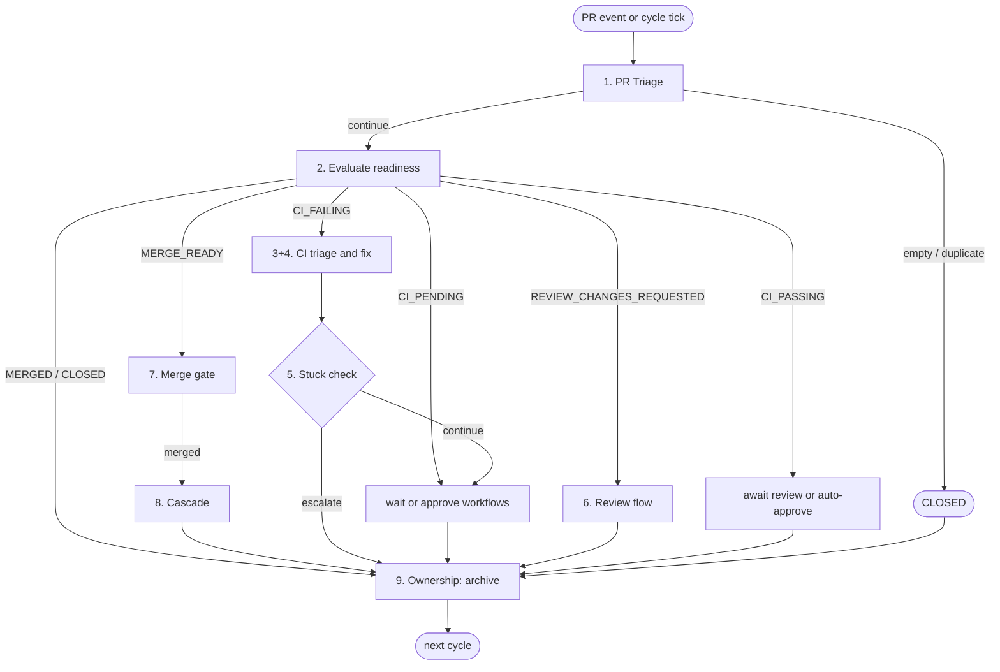
```mermaid
flowchart TD
  Start([PR event or cycle tick]) --> Triage[1. PR Triage]
  Triage -->|empty / duplicate| Closed([CLOSED])
  Triage -->|continue| Readiness[2. Evaluate readiness]
  Readiness -->|MERGED / CLOSED| Owner[9. Ownership: archive]
  Readiness -->|CI_PENDING| Wait[wait or approve workflows]
  Readiness -->|CI_FAILING| CIFix[3+4. CI triage and fix]
  Readiness -->|REVIEW_CHANGES_REQUESTED| Review[6. Review flow]
  Readiness -->|MERGE_READY| Merge[7. Merge gate]
  Readiness -->|CI_PASSING| Await[await review or auto-approve]
  Merge -->|merged| Cascade[8. Cascade]
  Cascade --> Owner
  CIFix --> Stuck{5. Stuck check}
  Stuck -->|escalate| Owner
  Stuck -->|continue| Wait
  Wait --> Owner
  Review --> Owner
  Await --> Owner
  Owner --> End([next cycle])
  Closed --> Owner
```

**Critical decisions:** which readiness verdict the state machine produces — this is the single fan-out that determines which sub-flow fires.

---

## 1. PR Triage — empty / duplicate cleanup

Cleans up trivial cases before any work happens. [pr_triage.py:136-173](../src/caretaker/pr_agent/pr_triage.py)

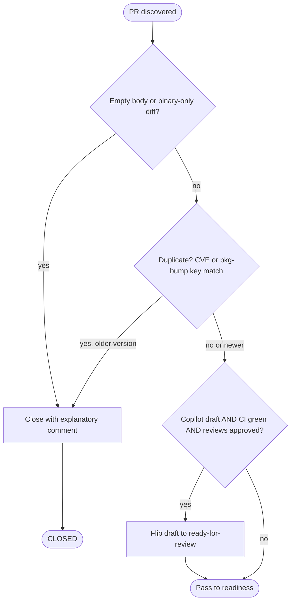
```mermaid
flowchart TD
  A([PR discovered]) --> B{Empty body or binary-only diff?}
  B -->|yes| C[Close with explanatory comment]
  B -->|no| D{Duplicate? CVE or pkg-bump key match}
  D -->|yes, older version| C
  D -->|no or newer| E{Copilot draft AND CI green AND reviews approved?}
  E -->|yes| F[Flip draft to ready-for-review]
  E -->|no| G([Pass to readiness])
  F --> G
  C --> H([CLOSED])
```

**Critical decisions:**
- Empty body: < 20 chars or no meaningful text
- Binary-only diff against `binary_only_paths` config
- Duplicate group key: CVE regex OR package bump pattern; **prefer newer version target** (loser gets closed)
- Copilot drafts only auto-flip when fully green

---

## 2. Readiness state machine

The heart of the agent. Each cycle computes a recommended state + action. [states.py:409, states.py:449-602](../src/caretaker/pr_agent/states.py)

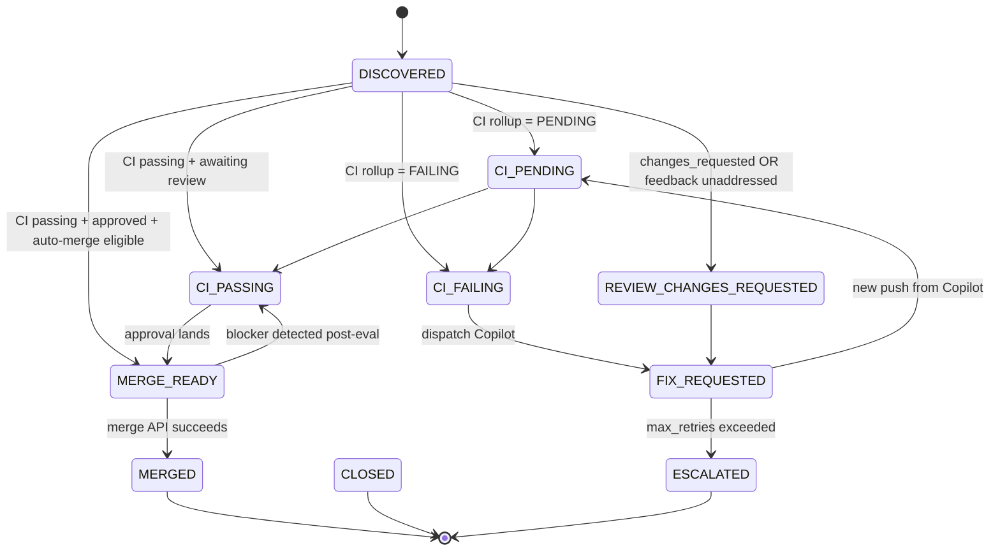
```mermaid
stateDiagram-v2
  [*] --> DISCOVERED
  DISCOVERED --> CI_PENDING: CI rollup = PENDING
  DISCOVERED --> CI_FAILING: CI rollup = FAILING
  DISCOVERED --> REVIEW_CHANGES_REQUESTED: changes_requested OR feedback unaddressed
  DISCOVERED --> MERGE_READY: CI passing + approved + auto-merge eligible
  DISCOVERED --> CI_PASSING: CI passing + awaiting review

  CI_PENDING --> CI_PASSING
  CI_PENDING --> CI_FAILING
  CI_FAILING --> FIX_REQUESTED: dispatch Copilot
  FIX_REQUESTED --> CI_PENDING: new push from Copilot
  FIX_REQUESTED --> ESCALATED: max_retries exceeded
  CI_PASSING --> MERGE_READY: approval lands
  REVIEW_CHANGES_REQUESTED --> FIX_REQUESTED
  MERGE_READY --> MERGED: merge API succeeds
  MERGE_READY --> CI_PASSING: blocker detected post-eval

  MERGED --> [*]
  CLOSED --> [*]
  ESCALATED --> [*]
```

**Critical decisions ([states.py:309-406](../src/caretaker/pr_agent/states.py)):**
- Draft? → halt (309-317)
- Merge conflict? → halt (318-319)
- CI rollup across all checks (350-357) — **MIXED treated as FAILING**
- Required reviews threshold + bot approval channels (339-348)
- Auto-merge policy varies by PR family: Copilot / Dependabot / caretaker / maintainer-bot / human (380-406)
- Auto-approve caretaker/maintainer PRs when CI green + no blockers

---

## 3. CI Triage — failure classification

Classifies *why* CI failed before deciding what to do about it. [ci_triage.py:62-102, 130+](../src/caretaker/pr_agent/ci_triage.py), [agent.py:929](../src/caretaker/pr_agent/agent.py)

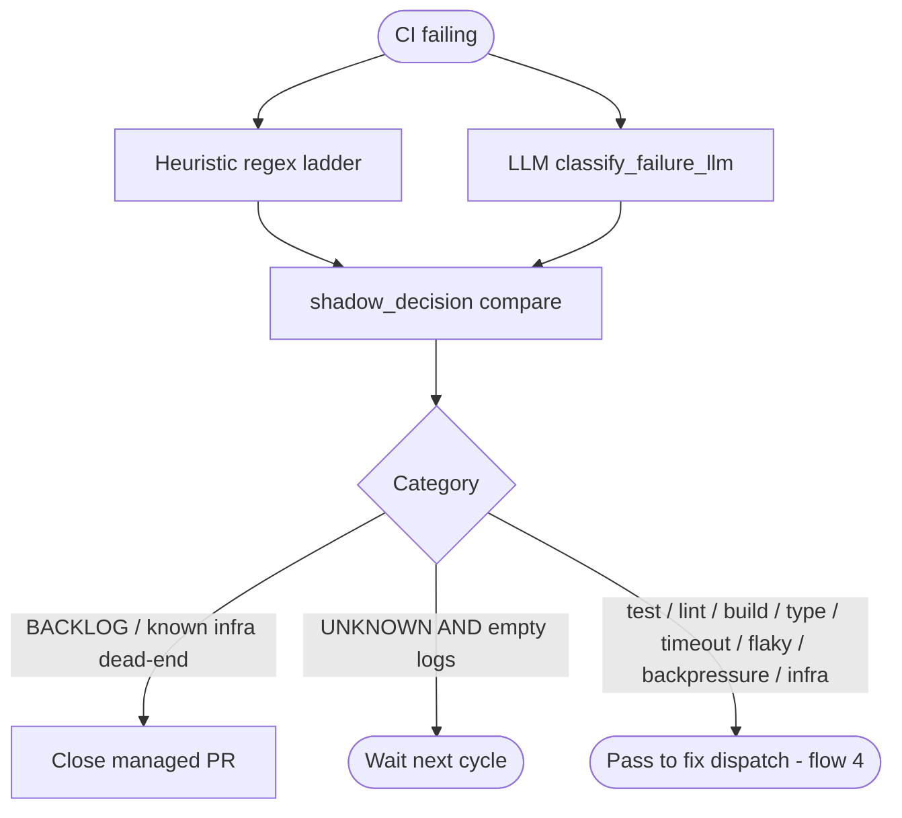
```mermaid
flowchart TD
  A([CI failing]) --> B[Heuristic regex ladder]
  A --> C[LLM classify_failure_llm]
  B --> D[shadow_decision compare]
  C --> D
  D --> E{Category}
  E -->|BACKLOG / known infra dead-end| F[Close managed PR]
  E -->|UNKNOWN AND empty logs| G([Wait next cycle])
  E -->|test / lint / build / type / timeout / flaky / backpressure / infra| H([Pass to fix dispatch - flow 4])
```

**Critical decisions:**
- `category` enum picks the path
- `is_transient` flag → suggests retry without code change
- `root_cause_hypothesis` + `suggested_fix` + `files_to_touch` are passed to Copilot

---

## 4. CI Fix dispatch — Copilot retry loop

The most decision-heavy flow. Lots of guard rails to avoid spam and runaway retries. [agent.py:856-979](../src/caretaker/pr_agent/agent.py)

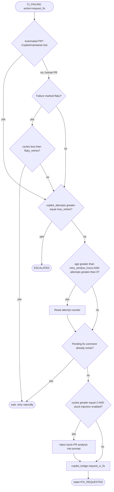
```mermaid
flowchart TD
  A([CI_FAILING action=request_fix]) --> B{Automated PR? Copilot/maintainer-bot}
  B -->|yes| F
  B -->|no, human PR| C{Failure marked flaky?}
  C -->|yes| D{cycles less than flaky_retries?}
  D -->|yes| E([wait, retry naturally])
  D -->|no| F
  C -->|no| F{copilot_attempts greater-equal max_retries?}
  F -->|yes| Z([ESCALATED])
  F -->|no| G{age greater-than retry_window_hours AND attempts greater-than 0?}
  G -->|yes| H[Reset attempt counter]
  G -->|no| I
  H --> I{Pending fix comment already exists?}
  I -->|yes| E
  I -->|no| J{cycles greater-equal 2 AND stuck-injection enabled?}
  J -->|yes| K[Inject stuck-PR analysis into prompt]
  J -->|no| L
  K --> L[copilot_bridge.request_ci_fix]
  L --> M([state=FIX_REQUESTED])
```

**Critical decisions:**
- **Flaky guard** only applies to human PRs — automated PRs skip the wait
- **Retry window** resets stale counters so a long-lived branch isn't permanently locked out
- **Pending-comment guard** prevents duplicate task spam
- **Stuck-injection** at cycle ≥ 2 enriches the Copilot prompt with deeper analysis (gated by feature flag)

---

## 5. Stuck PR detection

Runs each cycle after readiness; only fires past an age threshold. [agent.py:339-465, 620-645](../src/caretaker/pr_agent/agent.py), [stuck_pr_llm.py:60-67](../src/caretaker/pr_agent/stuck_pr_llm.py)

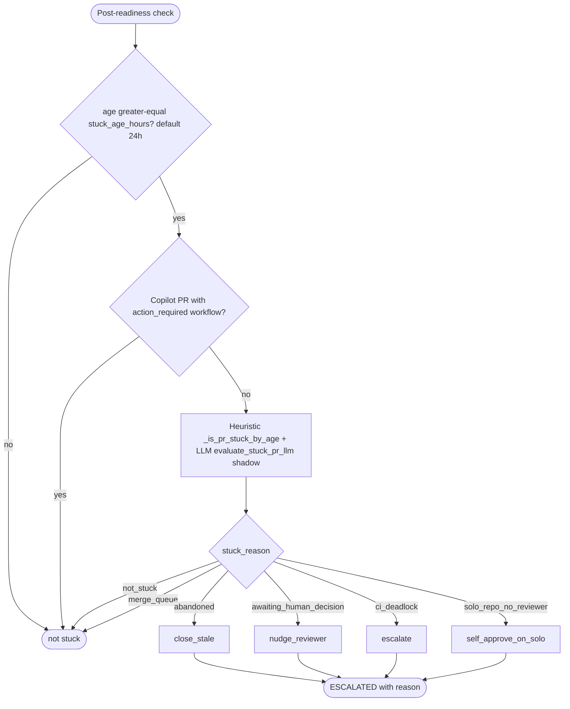
```mermaid
flowchart TD
  A([Post-readiness check]) --> B{age greater-equal stuck_age_hours? default 24h}
  B -->|no| OK([not stuck])
  B -->|yes| C{Copilot PR with action_required workflow?}
  C -->|yes| OK
  C -->|no| D[Heuristic _is_pr_stuck_by_age + LLM evaluate_stuck_pr_llm shadow]
  D --> E{stuck_reason}
  E -->|not_stuck| OK
  E -->|merge_queue| OK
  E -->|abandoned| F[close_stale]
  E -->|awaiting_human_decision| G[nudge_reviewer]
  E -->|ci_deadlock| H[escalate]
  E -->|solo_repo_no_reviewer| I[self_approve_on_solo]
  F --> Z([ESCALATED with reason])
  G --> Z
  H --> Z
  I --> Z
```

**Critical decisions:**
- **Copilot awaiting-approval exception** — don't classify as stuck if a workflow run is just waiting for `action_required`; the CI Approver (flow 10) handles that
- LLM distinguishes between **5 reasons** for stuckness, each mapping to a different escalation action
- **Skip escalation** if recommended action is `wait` or `request_fix` (already in motion)

---

## 6. Review flow — routing + verdict

Triggered when readiness produces `request_review_fix` or for proactive review. [routing.py:54-110](../src/caretaker/pr_reviewer/routing.py), [review.py:43-99](../src/caretaker/pr_agent/review.py)

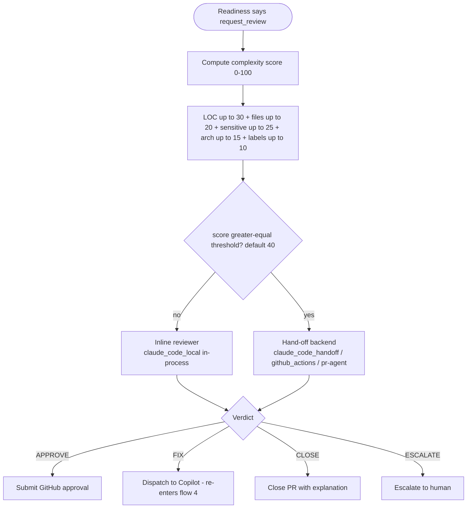
```mermaid
flowchart TD
  A([Readiness says request_review]) --> B[Compute complexity score 0-100]
  B --> C[LOC up to 30 + files up to 20 + sensitive up to 25 + arch up to 15 + labels up to 10]
  C --> D{score greater-equal threshold? default 40}
  D -->|no| E[Inline reviewer<br/>claude_code_local in-process]
  D -->|yes| F[Hand-off backend<br/>claude_code_handoff / github_actions / pr-agent]
  E --> G{Verdict}
  F --> G
  G -->|APPROVE| H[Submit GitHub approval]
  G -->|FIX| I[Dispatch to Copilot - re-enters flow 4]
  G -->|CLOSE| J[Close PR with explanation]
  G -->|ESCALATE| K[Escalate to human]
```

**Critical decisions:**
- **Score threshold** is the routing gate — small/safe PRs get fast in-process review; large/risky PRs go to a heavier handoff backend
- **Sensitive paths** (auth, infra, schema) carry the highest weight — single sensitive file can push score over threshold alone
- **Label signals**: `_COMPLEX_LABELS` add points, `_SIMPLE_LABELS` subtract
- 4-way verdict means review can **terminate the PR** (CLOSE) or just suggest fixes (FIX)

---

## 7. Merge gate + post-merge rollback

Last guard before merge, plus base-branch CI watcher. [merge.py:50-150, agent.py:744-817](../src/caretaker/pr_agent/merge.py)

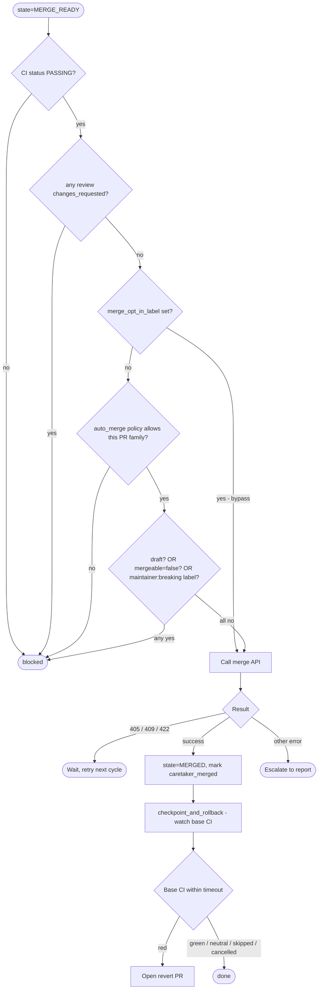
```mermaid
flowchart TD
  A([state=MERGE_READY]) --> B{CI status PASSING?}
  B -->|no| Block([blocked])
  B -->|yes| C{any review changes_requested?}
  C -->|yes| Block
  C -->|no| D{merge_opt_in_label set?}
  D -->|yes - bypass| H
  D -->|no| E{auto_merge policy allows this PR family?}
  E -->|no| Block
  E -->|yes| F{draft? OR mergeable=false? OR maintainer:breaking label?}
  F -->|any yes| Block
  F -->|all no| H[Call merge API]
  H --> I{Result}
  I -->|405 / 409 / 422| J([Wait, retry next cycle])
  I -->|success| K[state=MERGED, mark caretaker_merged]
  I -->|other error| L([Escalate to report])
  K --> M[checkpoint_and_rollback - watch base CI]
  M --> N{Base CI within timeout}
  N -->|red| O[Open revert PR]
  N -->|green / neutral / skipped / cancelled| P([done])
```

**Critical decisions:**
- **Family-based auto-merge policy** — separate flags per family (Copilot / Dependabot / caretaker / maintainer-bot / human); `merge_opt_in_label` is a per-PR override
- **Soft-fail merge errors** (405/409/422) → wait, don't escalate; **hard errors** → escalate
- **Post-merge rollback**: caretaker watches base-branch CI and **opens its own revert PR** if the merge poisons main — `NEUTRAL`/`SKIPPED`/`CANCELLED` are not red

---

## 8. Cascade — linked-issue cleanup

Fires when a PR reaches a terminal state. [cascade.py:51-100](../src/caretaker/pr_agent/cascade.py)

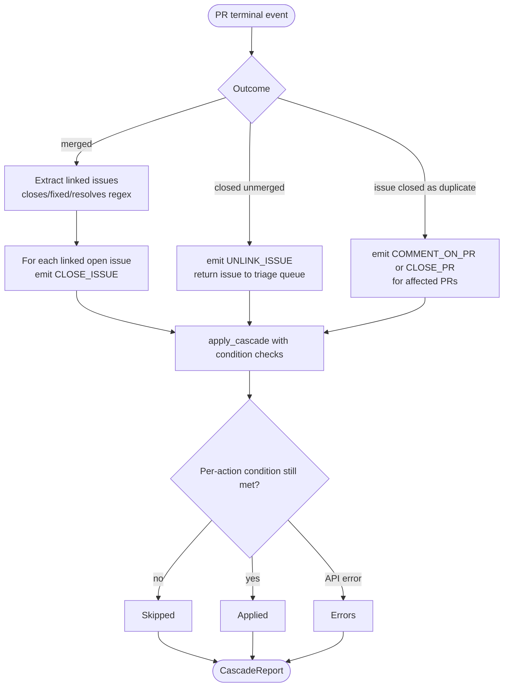
```mermaid
flowchart TD
  A([PR terminal event]) --> B{Outcome}
  B -->|merged| C[Extract linked issues<br/>closes/fixed/resolves regex]
  C --> D[For each linked open issue<br/>emit CLOSE_ISSUE]
  B -->|closed unmerged| E[emit UNLINK_ISSUE<br/>return issue to triage queue]
  B -->|issue closed as duplicate| F[emit COMMENT_ON_PR or CLOSE_PR<br/>for affected PRs]
  D --> G[apply_cascade with condition checks]
  E --> G
  F --> G
  G --> H{Per-action condition still met?}
  H -->|no| I[Skipped]
  H -->|yes| J[Applied]
  H -->|API error| K[Errors]
  I --> R([CascadeReport])
  J --> R
  K --> R
```

**Critical decisions:**
- 4 action types: `CLOSE_ISSUE`, `UNLINK_ISSUE`, `COMMENT_ON_PR`, `CLOSE_PR`
- **Conditions are re-checked at apply time** — an issue closed by another path between plan and apply is skipped, not retried

---

## 9. Ownership — status comment lifecycle

Runs at the end of every cycle. [ownership.py](../src/caretaker/pr_agent/ownership.py)

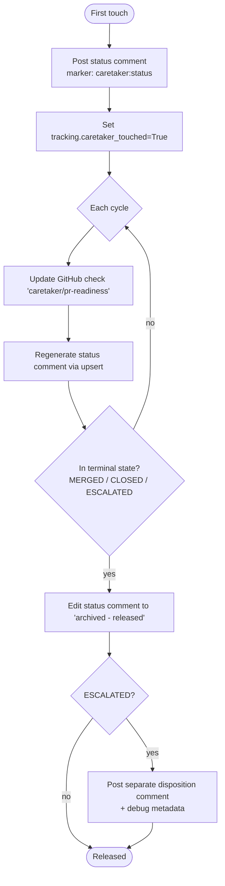
```mermaid
flowchart TD
  A([First touch]) --> B[Post status comment<br/>marker: caretaker:status]
  B --> C[Set tracking.caretaker_touched=True]
  C --> D{Each cycle}
  D --> E[Update GitHub check 'caretaker/pr-readiness']
  E --> F[Regenerate status comment via upsert]
  F --> G{In terminal state?<br/>MERGED / CLOSED / ESCALATED}
  G -->|no| D
  G -->|yes| H[Edit status comment to 'archived - released']
  H --> I{ESCALATED?}
  I -->|yes| J[Post separate disposition comment<br/>+ debug metadata]
  I -->|no| K([Released])
  J --> K
```

**Critical decisions:**
- **One-comment-per-PR invariant** via marker + upsert pattern — never spam a PR with new comments per cycle
- **Released flag is sticky** — won't re-touch a released PR even if it transitions out of terminal state (e.g. reopened)

---

## 10. CI Approver — `action_required` workflow runs

Standalone agent. [pr_ci_approver/agent.py:40-150+](../src/caretaker/pr_ci_approver/agent.py)

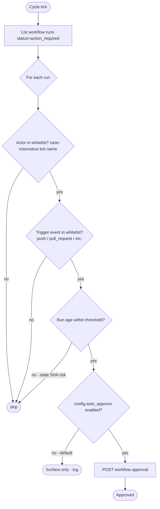
```mermaid
flowchart TD
  A([Cycle tick]) --> B[List workflow runs status=action_required]
  B --> C{For each run}
  C --> D{Actor in whitelist? case-insensitive bot name}
  D -->|no| Skip([skip])
  D -->|yes| E{Trigger event in whitelist?<br/>push / pull_request / etc.}
  E -->|no| Skip
  E -->|yes| F{Run age within threshold?}
  F -->|no - stale SHA risk| Skip
  F -->|yes| G{config.auto_approve enabled?}
  G -->|no - default| H([Surface only - log])
  G -->|yes| I[POST workflow approval]
  I --> J([Approved])
```

**Critical decisions:**
- **Three-filter whitelist**: actor + trigger event + age. Age filter exists specifically to avoid approving workflow runs against stale commits
- **Default is read-only** (`auto_approve=false`) — operators must opt in per repo

---

## Summary of cross-flow invariants

| Invariant | Where enforced |
|---|---|
| One status comment per PR | Ownership (flow 9) marker pattern |
| Terminal states are final | State machine (flow 2) + Ownership (flow 9) |
| No retry storms | Fix dispatch (flow 4) max_retries + retry_window + pending-comment guards |
| Stale SHA protection | CI Approver (flow 10) age filter |
| Base-branch protection | Merge (flow 7) post-merge rollback watcher |
| Heuristic + LLM coexist | `@shadow_decision` wrappers in flows 3 and 5 |
| Family-aware policy | Triage (flow 1) + Readiness (flow 2) + Merge (flow 7) all branch on PR family |

---

## Open questions worth checking

1. **Flow 4 ordering**: is the *flaky guard* check evaluated before or after the *max_retries* check? The diagram shows flaky→max_retries; verify against [agent.py:856-914](../src/caretaker/pr_agent/agent.py).
2. **Flow 5 → Flow 7 interaction**: if `solo_repo_no_reviewer` triggers `self_approve_on_solo`, does that loop back to readiness in the same cycle, or wait for the next?
3. **Flow 7 rollback**: does the revert PR itself enter caretaker management, and could that lead to a revert-of-revert loop?
4. **Two-phase triage gate** (recent commit 658c8d6): that lives in *issue dispatch*, not PR flows — none of the PR triage code currently has a similar phase-2 confirmation gate. Should it?

---

# Deep dives — flows 4, 7, and the shadow pattern

After reading the actual code, the high-level diagrams above need precision adjustments. The deep dives below are line-accurate to current `main` at HEAD ≈ `9b51c89`.

---

## Deep dive 4 — CI fix dispatch (verified ordering)

The orchestrator runs the **stuck-PR check first** ([agent.py:610-645](../src/caretaker/pr_agent/agent.py)) — *before* dispatching to `_handle_ci_fix`. So flow 5 short-circuits flow 4 when the PR is judged stuck. The master orchestration diagram in §0 had this backwards — corrected mental model:

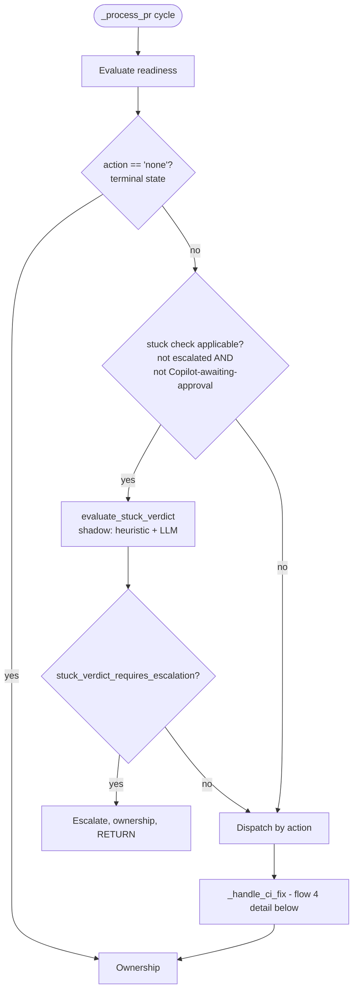
```mermaid
flowchart TD
  A([_process_pr cycle]) --> B[Evaluate readiness]
  B --> C{action == 'none'?<br/>terminal state}
  C -->|yes| Owner[Ownership]
  C -->|no| D{stuck check applicable?<br/>not escalated AND<br/>not Copilot-awaiting-approval}
  D -->|yes| E[evaluate_stuck_verdict<br/>shadow: heuristic + LLM]
  E --> F{stuck_verdict_requires_escalation?}
  F -->|yes| G[Escalate, ownership, RETURN]
  F -->|no| H
  D -->|no| H[Dispatch by action]
  H --> CIFix[_handle_ci_fix - flow 4 detail below]
  CIFix --> Owner
```

### Flow 4 — exact decision order ([agent.py:845-980](../src/caretaker/pr_agent/agent.py))

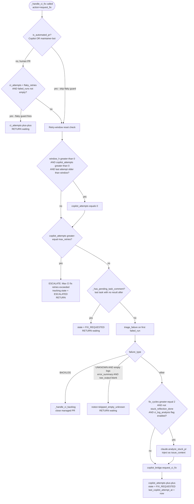
```mermaid
flowchart TD
  A([_handle_ci_fix called<br/>action=request_fix]) --> B{is_automated_pr?<br/>Copilot OR maintainer-bot}
  B -->|no, human PR| C{ci_attempts &lt; flaky_retries<br/>AND failed_runs not empty?}
  C -->|yes - flaky guard fires| D[ci_attempts plus-plus<br/>RETURN waiting]
  C -->|no| E
  B -->|yes - skip flaky guard| E[Retry-window reset check]
  E --> F{window_h greater-than 0<br/>AND copilot_attempts greater-than 0<br/>AND last attempt older than window?}
  F -->|yes| G[copilot_attempts equals 0]
  F -->|no| H
  G --> H{copilot_attempts greater-equal max_retries?}
  H -->|yes| I[ESCALATE: Max CI fix retries exceeded<br/>tracking.state = ESCALATED<br/>RETURN]
  H -->|no| J{_has_pending_task_comment?<br/>last task with no result after}
  J -->|yes| K[state = FIX_REQUESTED<br/>RETURN waiting]
  J -->|no| L[triage_failure on first failed_run]
  L --> M{failure_type}
  M -->|BACKLOG| N[_handle_ci_backlog<br/>close managed PR]
  M -->|UNKNOWN AND empty logs<br/>error_summary AND raw_output blank| O[notes=skipped_empty_unknown<br/>RETURN waiting]
  M -->|other| P{fix_cycles greater-equal 2<br/>AND not stuck_reflection_done<br/>AND ci_log_analysis flag enabled?}
  P -->|yes| Q[claude.analyze_stuck_pr<br/>inject as issue_context]
  P -->|no| R
  Q --> R[copilot_bridge.request_ci_fix]
  R --> S[copilot_attempts plus-plus<br/>state = FIX_REQUESTED<br/>last_copilot_attempt_at = now]
```

### Verified facts

| Fact | Reference |
|---|---|
| **Order**: flaky-guard → window-reset → max-retries → pending-comment → triage | [agent.py:856-927](../src/caretaker/pr_agent/agent.py) |
| Flaky guard skipped for automated PRs (Copilot / maintainer-bot) | [agent.py:855-869](../src/caretaker/pr_agent/agent.py) |
| Window reset zeros `copilot_attempts` (not `ci_attempts`) | [agent.py:874-892](../src/caretaker/pr_agent/agent.py) |
| Max-retries gate uses `copilot_attempts`, not `fix_cycles` or `ci_attempts` | [agent.py:895](../src/caretaker/pr_agent/agent.py) |
| Stuck-injection trigger is `fix_cycles >= 2` (different counter from `copilot_attempts`) | [agent.py:989](../src/caretaker/pr_agent/agent.py) |
| `fix_cycles` increments on `FIX_REQUESTED → CI_FAILING` transition only | [agent.py:656-662](../src/caretaker/pr_agent/agent.py) |
| Triage processes only the **first** failed run per cycle (`failed_runs[:1]`) | [agent.py:928](../src/caretaker/pr_agent/agent.py) |

### Three counters — easy to confuse

- **`ci_attempts`** — flaky-retry watchdog. Bumped in the silent-wait branch, **never reset by window logic**, and only consulted before the flaky guard.
- **`copilot_attempts`** — actual @copilot dispatches. Bumped after `request_ci_fix` succeeds, reset by the retry-window logic, consulted by the max-retries gate.
- **`fix_cycles`** — round-trip counter. Bumped when a Copilot fix lands (`FIX_REQUESTED → CI_FAILING`), gates the stuck-injection prompt enrichment.

This separation matters: a flaky-CI human PR can spin its `ci_attempts` for a while without ever counting against `max_retries`, but `fix_cycles` will stay at 0 because no actual fix dispatch happened.

### Flow 4 risk areas

1. **Pending-comment guard depends on Copilot posting a `caretaker:result` reply.** If Copilot fails silently or the reply marker drifts, every cycle short-circuits to "waiting" forever — the PR never escalates. Worth checking [agent.py:818-843](../src/caretaker/pr_agent/agent.py) against actual Copilot reply behaviour.
2. **`failed_runs[:1]`**: caretaker only tries to fix one job per cycle. A PR with two unrelated failures will require two cycles. Fine, but easy to forget when reasoning about throughput.
3. **Window reset doesn't reset `ci_attempts`** — a long-lived flaky human PR can permanently have `ci_attempts >= flaky_retries`, meaning the flaky guard never fires again on it. Probably intentional (the retry already happened), but worth documenting.

---

## Deep dive 7 — Merge gate, with a divergence finding

### Finding: production never executes the rollback wrapper

[merge.py:164-263](../src/caretaker/pr_agent/merge.py) implements `perform_merge()` with the post-merge rollback wrapper. **It is not called by the agent.** [agent.py:744-817](../src/caretaker/pr_agent/agent.py) `_handle_merge` calls `self._github.merge_pull_request()` directly. Confirmed: `grep -rn perform_merge src/caretaker/pr_agent/` shows references only inside `merge.py` itself; tests in [tests/test_pr_agent_perform_merge.py](../tests/test_pr_agent_perform_merge.py) cover `perform_merge` but production does not invoke it.

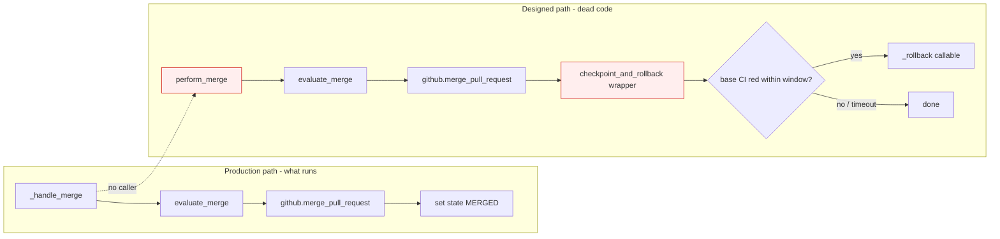
```mermaid
flowchart LR
  subgraph "Production path - what runs"
    A1[_handle_merge] --> A2[evaluate_merge]
    A2 --> A3[github.merge_pull_request]
    A3 --> A4[set state MERGED]
  end
  subgraph "Designed path - dead code"
    B1[perform_merge] --> B2[evaluate_merge]
    B2 --> B3[github.merge_pull_request]
    B3 --> B4[checkpoint_and_rollback wrapper]
    B4 --> B5{base CI red within window?}
    B5 -->|yes| B6[_rollback callable]
    B5 -->|no / timeout| B7[done]
  end
  A1 -.no caller.-> B1
  style B1 fill:#fee,stroke:#c00
  style B4 fill:#fee,stroke:#c00
```

### Finding: the rollback callable is itself a placeholder

Even if `perform_merge` were wired up, the `_rollback` closure at [merge.py:230-246](../src/caretaker/pr_agent/merge.py) just **opens an issue tagged `caretaker:rollback`**. It does not run a `git revert` or open a revert PR. Doc-string at line 184-187 explicitly acknowledges this: *"Shipping the full auto-revert closure lives in a follow-up PR so this change stays reviewable."*

So the rollback verb in the §7 diagram of the original document was overstated. Corrected:

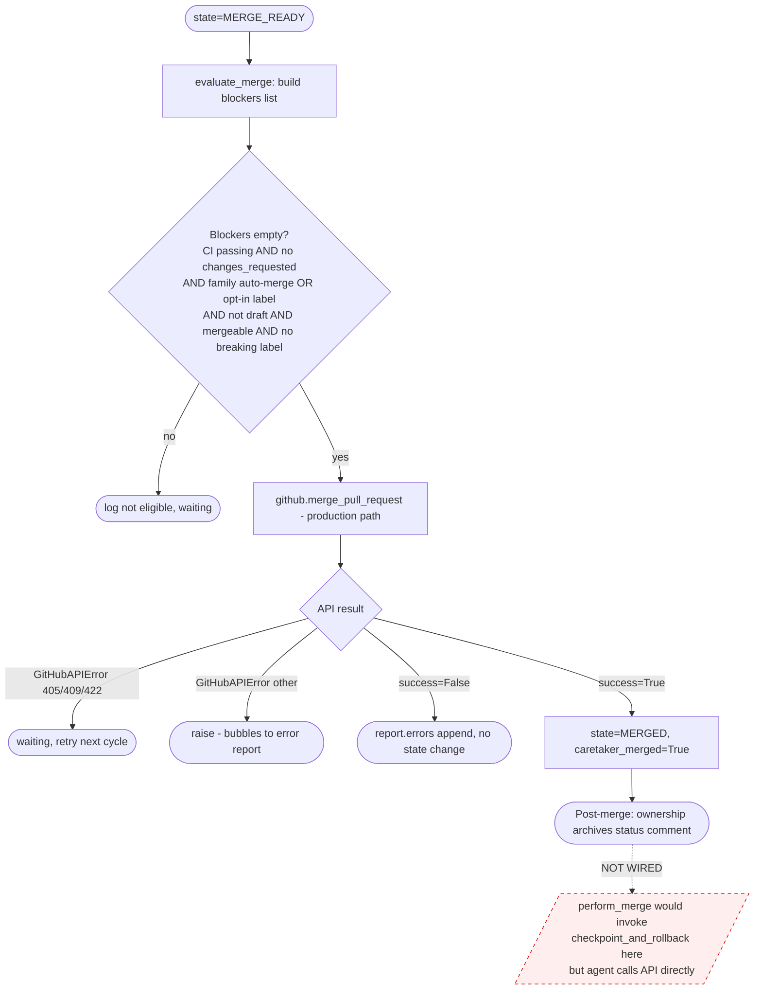
```mermaid
flowchart TD
  A([state=MERGE_READY]) --> B[evaluate_merge: build blockers list]
  B --> C{Blockers empty?<br/>CI passing AND no changes_requested<br/>AND family auto-merge OR opt-in label<br/>AND not draft AND mergeable AND no breaking label}
  C -->|no| Block([log not eligible, waiting])
  C -->|yes| D[github.merge_pull_request - production path]
  D --> E{API result}
  E -->|GitHubAPIError 405/409/422| F([waiting, retry next cycle])
  E -->|GitHubAPIError other| G([raise - bubbles to error report])
  E -->|success=False| H([report.errors append, no state change])
  E -->|success=True| I[state=MERGED, caretaker_merged=True]
  I --> J([Post-merge: ownership archives status comment])
  J -.NOT WIRED.-> K[/perform_merge would invoke<br/>checkpoint_and_rollback here<br/>but agent calls API directly/]
  style K fill:#fee,stroke:#c00,stroke-dasharray:5
```

### Verified merge-gate ordering ([merge.py:50-108](../src/caretaker/pr_agent/merge.py))

The blockers list is **built in this order, all independent** — no early-exit. This means a single PR can accumulate multiple blockers in one evaluation pass:

1. CI status not PASSING
2. `reviews.changes_requested`
3. Auto-merge policy (5-way switch on PR family + opt-in label override)
4. Draft status
5. `mergeable is False`
6. `maintainer:breaking` label

`should_merge = len(blockers) == 0`. This is good — diagnosis logs at [agent.py:800-814](../src/caretaker/pr_agent/agent.py) emit the full blockers list when an approved PR is still blocked, which is the case the comments call out as "portfolio #151-class" (Copilot pushed a new commit post-approval).

### Risks in flow 7

| Risk | Detail |
|---|---|
| **Rollback dead code rots** | `perform_merge` and tests exist but never run in prod. Either wire it in or delete it; today it gives a false sense of safety. |
| **Diagnosis log spam** | The "approved-but-blocked diagnosis" log at agent.py:800 fires every cycle on a stuck-approved PR. No throttling — could be noisy on a long-running blocked PR. |
| **`success=False` from `merge_pull_request`** | Treated as an error and reported, but no state change — next cycle will re-attempt. Could thrash if the API is consistently returning false (rate limiting? branch protection?). |
| **Family policy is `elif`-chained** | A PR matching multiple family flags (rare but possible — e.g. caretaker bot opening dependabot PRs) takes the first branch only. Verify family-detection is mutually exclusive. |

---

## Deep dive — Shadow decision pattern (flows 3 and 5, plus 6 readiness/review)

The shadow infrastructure lives at [src/caretaker/evolution/shadow.py](../src/caretaker/evolution/shadow.py). It's a single decorator, three modes, used at **8 call sites** in PR flows alone (readiness, ci_triage, review_classification, stuck_pr, cascade x2, plus executor_routing and crystallizer_category outside PR scope).

### The three modes

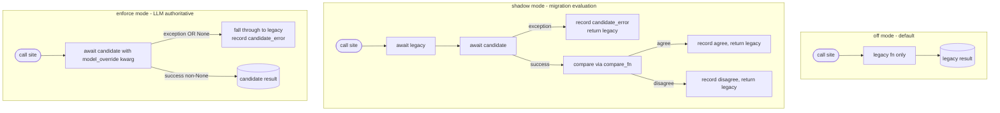
```mermaid
flowchart TD
  subgraph "off mode - default"
    O1([call site]) --> O2[legacy fn only]
    O2 --> O3[(legacy result)]
  end
  subgraph "shadow mode - migration evaluation"
    S1([call site]) --> S2[await legacy]
    S2 --> S3[await candidate]
    S3 -->|exception| S4[record candidate_error<br/>return legacy]
    S3 -->|success| S5[compare via compare_fn]
    S5 -->|agree| S6[record agree, return legacy]
    S5 -->|disagree| S7[record disagree, return legacy]
  end
  subgraph "enforce mode - LLM authoritative"
    E1([call site]) --> E2[await candidate with model_override kwarg]
    E2 -->|exception OR None| E3[fall through to legacy<br/>record candidate_error]
    E2 -->|success non-None| E4[(candidate result)]
  end
```

### Critical safety properties ([shadow.py:497-600](../src/caretaker/evolution/shadow.py))

| Property | Where | Why it matters |
|---|---|---|
| Shadow mode **always returns legacy** | [shadow.py:537, 572, 600](../src/caretaker/evolution/shadow.py) | Migration is byte-identical to off-mode. Disagreements are observed, not acted on. |
| Candidate failure in shadow is **swallowed** | [shadow.py:541-545](../src/caretaker/evolution/shadow.py) | Legacy hot path is never affected by an LLM blip. |
| Enforce falls back to legacy on **exception OR None** | [shadow.py:506-528](../src/caretaker/evolution/shadow.py) | Same safety net once the LLM is authoritative. |
| Legacy runs first in shadow mode | [shadow.py:537](../src/caretaker/evolution/shadow.py) comment: *"Legacy first so a candidate failure never blocks the hot path"* | Even latency is bounded — legacy result is computed before the candidate is even invoked. |
| Per-site `model_override` injected only into candidate | [shadow.py:480-495](../src/caretaker/evolution/shadow.py) | Legacy signature is never modified — keeps migration friction low. |
| Records persisted to Neo4j or fallback log | [shadow.py:194-248](../src/caretaker/evolution/shadow.py) | Reconstructable from log line alone if Neo4j is down. |

### The compare function design choice

Each call site gets its own `compare` function. They are **deliberately loose**:

```python
# agent.py:104-114 — stuck PR
def _stuck_verdicts_agree(a, b):
    return a.is_stuck == b.is_stuck and a.recommended_action == b.recommended_action
    # IGNORES: stuck_reason, explanation, confidence

# agent.py:73-91 — readiness
def _readiness_verdicts_agree(a, b):
    return a.verdict == b.verdict
    # IGNORES: blockers list, summary, human_reason
```

**Why this matters for verification:** the disagreement counter only fires on the fields that drive downstream behaviour. The LLM can produce richer `stuck_reason` / `blockers` content without inflating the disagreement metric — but it also means **semantic disagreements that don't affect the verdict are invisible to the dashboard**. If the LLM systematically produces wrong `stuck_reason` while landing on the right `recommended_action`, you'd never see it via shadow mode alone. That's a deliberate trade-off (better signal-to-noise for the migration call), but worth knowing when reading agreement-rate stats.

### Where shadow_decision lives in PR flows

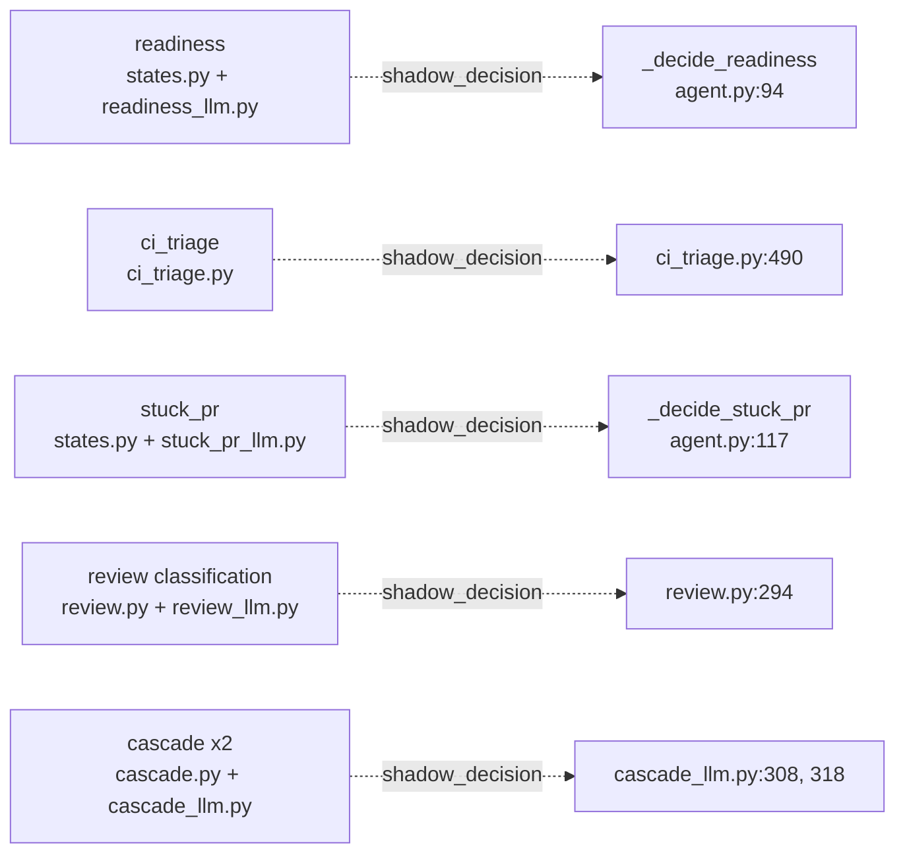
```mermaid
flowchart LR
  R[readiness<br/>states.py + readiness_llm.py] -.shadow_decision.-> R2[_decide_readiness<br/>agent.py:94]
  T[ci_triage<br/>ci_triage.py] -.shadow_decision.-> T2[ci_triage.py:490]
  S[stuck_pr<br/>states.py + stuck_pr_llm.py] -.shadow_decision.-> S2[_decide_stuck_pr<br/>agent.py:117]
  Rev[review classification<br/>review.py + review_llm.py] -.shadow_decision.-> Rev2[review.py:294]
  C[cascade x2<br/>cascade.py + cascade_llm.py] -.shadow_decision.-> C2[cascade_llm.py:308, 318]
```

### Verification angles for shadow

1. **Agreement rate per site** — query `caretaker_shadow_decisions_total{outcome="disagree"} / total` per `name`. Sites < 90% agreement are not ready for `enforce`.
2. **`candidate_error` rate** — high error rate in shadow means flipping to enforce will produce frequent legacy fallbacks. The metric is the same in both modes, so a clean shadow run de-risks enforce promotion.
3. **Compare-fn coverage** — the loose comparators may hide semantic disagreement. For each site, ask: "if legacy and candidate produce the same verdict but for different stated reasons, do we care?" If yes, the compare function is too loose.
4. **Model override hygiene** — an `enforce` site running the candidate with a stale model override and no `default_model` falls back silently. Check [shadow.py:471-472](../src/caretaker/evolution/shadow.py) `candidate_model = model_override or default_model` — if both are None the record's `candidate_model` is None, which is a useful signal in audit queries.

---

## Updated open questions

1. **Wire `perform_merge` or delete it?** Today it's tested but unreachable from the agent. The rollback callable is also a placeholder. This is the highest-priority finding from the audit.
2. **`ci_attempts` counter never resets** — intentional, or stale? Window reset only touches `copilot_attempts`.
3. **Pending-comment guard's failure mode** — what if Copilot never posts a `caretaker:result` reply? The PR seems to wedge in `FIX_REQUESTED` indefinitely.
4. **Shadow enforce-readiness criteria** — is there a documented agreement-rate threshold before flipping a site to `enforce`? If not, the migration is gated on operator gut-feel.
5. **Loose compare functions** — should we have a second-tier "informational disagreement" record for fields outside the compare? Useful for catching semantic drift even when the verdict matches.

---

# Follow-up findings (post-cleanup pull)

After pulling [main@1f979ef](../) — the dead-code cleanup commit (#654, −2,890 lines) — and digging into the three open areas. **Note: the cleanup did not touch `pr_agent/merge.py` or `agent.py`.** The fact that `perform_merge` survived a deliberate dead-code purge is itself signal.

## Follow-up 1 — Rollback wiring is intentional pre-wire infrastructure

**Status:** dead in production, not by accident.

### Evidence

- `perform_merge` ([merge.py:164](../src/caretaker/pr_agent/merge.py)) survived the cleanup commit that explicitly removed 2,890 lines of dead code. Author chose not to delete it.
- The originating commit [ba27e03](https://github.com/ianlintner/caretaker/commit/ba27e03) framed guardrails as the *"pre-condition R&D workstream A5 calls out before we expand shadow traffic onto the external fleet"* — i.e. it was always pre-wire infrastructure.
- `MergeRollbackConfig.enabled = False` by default ([guardrails/policy.py:113](../src/caretaker/guardrails/policy.py)). The wire-up has a hard kill switch.
- The doc reference at [merge.py:181](../src/caretaker/pr_agent/merge.py) points at `docs/r-and-d/A5.md` — **a path that does not exist**. The repo only has `docs/plans/`. Either the planning doc was renamed/moved or the path was aspirational.
- `checkpoint_and_rollback` has only three callers in `src/`: `merge.py` (uncalled), an example docstring, and the function definition itself. **Zero production callers anywhere in caretaker today.**

### Two pieces of dead-yet-tested infrastructure

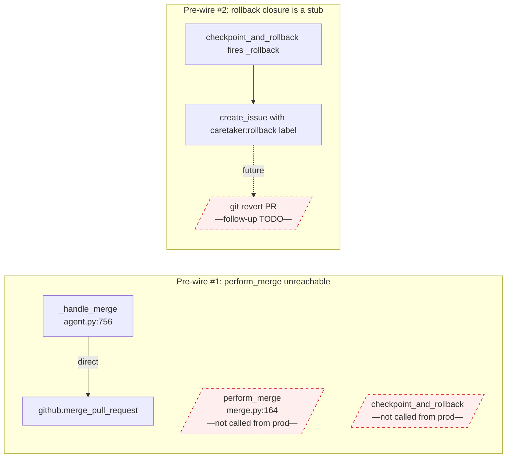
```mermaid
flowchart LR
  subgraph "Pre-wire #1: perform_merge unreachable"
    A[_handle_merge<br/>agent.py:756] -->|direct| B[github.merge_pull_request]
    C[/perform_merge<br/>merge.py:164<br/>—not called from prod—/]
    D[/checkpoint_and_rollback<br/>—not called from prod—/]
  end
  subgraph "Pre-wire #2: rollback closure is a stub"
    E[checkpoint_and_rollback fires _rollback] --> F[create_issue with caretaker:rollback label]
    G[/git revert PR<br/>—follow-up TODO—/]
    F -.future.-> G
  end
  style C fill:#fee,stroke:#c00,stroke-dasharray:5
  style D fill:#fee,stroke:#c00,stroke-dasharray:5
  style G fill:#fee,stroke:#c00,stroke-dasharray:5
```

### Recommendation

The wire-up is a one-line change at [agent.py:756](../src/caretaker/pr_agent/agent.py): replace the direct `merge_pull_request` call with `perform_merge(...)`. Since `MergeRollbackConfig.enabled` defaults to `False`, the change is observably a no-op until someone flips the toggle — the rollout is gated independently.

**Two things should land together:**
1. Wire `perform_merge` into `_handle_merge` so the rollback wrapper is even reachable.
2. Either fix the broken doc reference (`docs/r-and-d/A5.md`) or delete it — pointing readers at a non-existent file is worse than no reference.

The actual auto-revert closure (replacing the issue-creation stub) is a separate, larger piece of work and reasonable to defer.

## Follow-up 2 — The three counters, with one new finding

### Counter responsibilities (verified)

| Counter | Where bumped | Where reset | Where consumed |
|---|---|---|---|
| `ci_attempts` | [agent.py:861](../src/caretaker/pr_agent/agent.py) flaky-retry only | **never reset** | flaky-retry guard, [agent.py:858](../src/caretaker/pr_agent/agent.py) |
| `copilot_attempts` | [agent.py:966](../src/caretaker/pr_agent/agent.py) post-CI-dispatch + [agent.py:1277](../src/caretaker/pr_agent/agent.py) post-review-dispatch | retry-window reset, [agent.py:892](../src/caretaker/pr_agent/agent.py) (CI path only) | max-retries gate, both dispatch sites |
| `fix_cycles` | [agent.py:660](../src/caretaker/pr_agent/agent.py) FIX_REQUESTED→CI_FAILING transition | **never reset** | stuck-injection prompt enrichment trigger ≥ 2 |

### New finding: `copilot_attempts` is shared across CI-fix AND review-fix paths

This wasn't surfaced in the original walkthrough. There are **two `copilot_attempts` increment sites**:
- [agent.py:966](../src/caretaker/pr_agent/agent.py) — CI fix dispatch via `_handle_ci_fix`
- [agent.py:1277](../src/caretaker/pr_agent/agent.py) — Review fix dispatch via `_handle_review_fix`

Both increment the same counter. Both gate on `max_retries`. **But only the CI fix path has the retry-window reset logic.** The review-fix dispatch reads the un-reset counter:

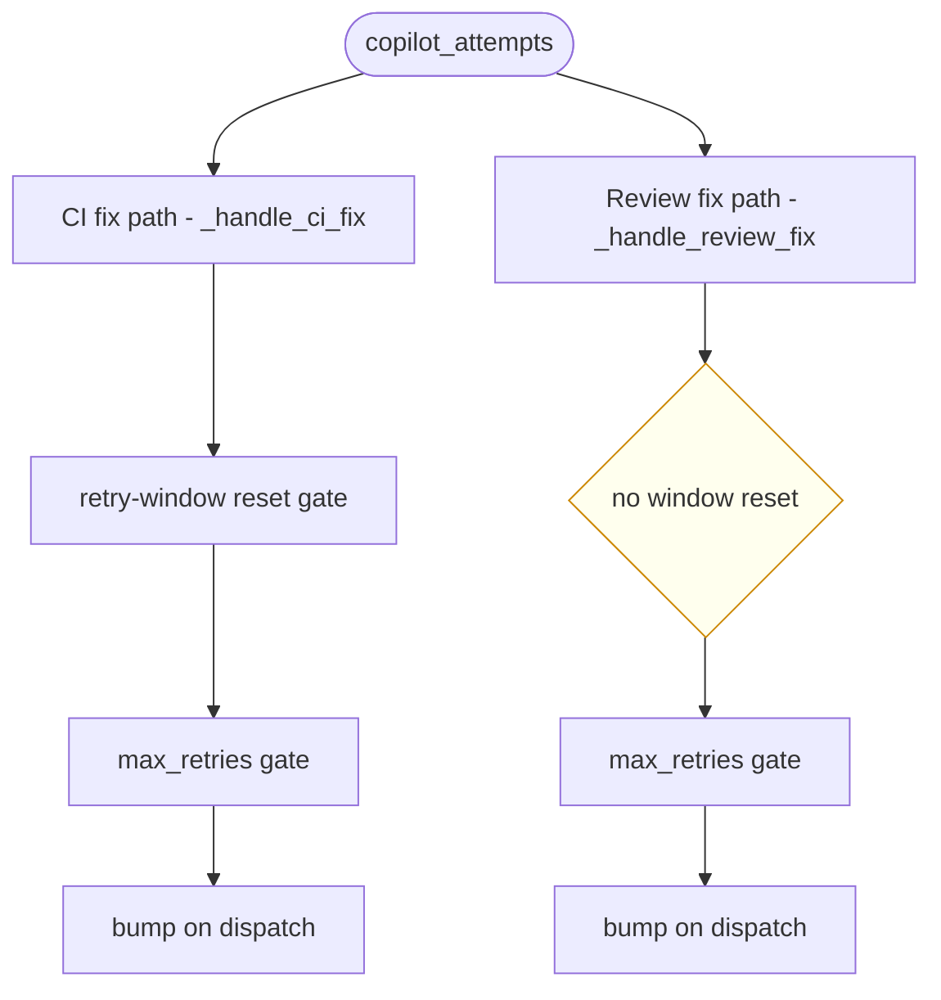
```mermaid
flowchart TD
  A([copilot_attempts]) --> B[CI fix path - _handle_ci_fix]
  A --> C[Review fix path - _handle_review_fix]
  B --> B1[retry-window reset gate]
  B1 --> B2[max_retries gate]
  B2 --> B3[bump on dispatch]
  C --> C1{no window reset}
  C1 --> C2[max_retries gate]
  C2 --> C3[bump on dispatch]
  style C1 fill:#ffe,stroke:#c80
```

**Behavioral consequence:** a long-lived PR that exhausted CI fix attempts months ago, then receives a review-fix today, will see its **stale** `copilot_attempts` count and may immediately escalate. The window-reset only saves it on the CI path.

This is probably a real rough edge. Either lift the reset into a shared helper that both dispatchers call, or split into two counters (`ci_dispatch_attempts` / `review_dispatch_attempts`).

### Worked example — three counters in concert

For a long-lived human PR with `flaky_retries=2`, `max_retries=3`, `retry_window_hours=72`:

| Cycle | Event | `ci_attempts` | `copilot_attempts` | `fix_cycles` | What happens |
|---|---|---|---|---|---|
| 1 | CI fails | 0→1 | 0 | 0 | flaky guard: silent wait |
| 2 | CI still failing | 1→2 | 0 | 0 | flaky guard: silent wait |
| 3 | CI still failing | 2 (no bump, ≥ flaky_retries) | 0→1 | 0 | dispatch #1 |
| 4 | Copilot pushes, CI fails | 2 | 1 | 0→1 | (transition counted) |
| 5 | dispatch fires | 2 | 1→2 | 1 | dispatch #2 |
| 6 | Copilot pushes, CI fails | 2 | 2 | 1→2 | stuck-injection now active |
| 7 | dispatch fires | 2 | 2→3 | 2 | dispatch #3 with stuck analysis injected |
| 8 | Copilot pushes, CI fails | 2 | 3 | 2→3 | — |
| 9 | dispatch attempted | 2 | 3 (≥ max_retries) | 3 | **ESCALATE** |
| ...later... 80 hrs idle, then CI fails again | | 2 | 3 | 3 | window reset: copilot_attempts → 0; cycle restarts |

Note `ci_attempts` saturates at the flaky threshold and never resets. After cycle 3 it is functionally inert for the lifetime of the PR.

### Risks confirmed

1. **Stale `copilot_attempts` for review-fix dispatch** — see new finding above. Highest priority of the three.
2. **`ci_attempts` permanent saturation** — long-lived flaky human PRs lose the silent-wait behavior. Probably intentional but worth a comment in the code.
3. **`fix_cycles` is monotonic** — every cycle past 2 carries the stuck-injection prompt enrichment. For a Copilot-PR that thrashes for weeks, that's potentially a lot of LLM tokens. Trigger should arguably reset on a successful Copilot push, not just on dispatch.

## Follow-up 3 — Shadow promotion has documented criteria + CI enforcement

This was the most exploratory question, and the answer is the most reassuring: the migration has formal gates, not gut-feel.

### The contract

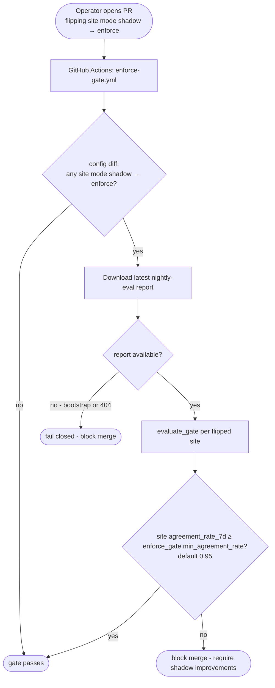
```mermaid
flowchart TD
  A([Operator opens PR<br/>flipping site mode shadow → enforce]) --> B[GitHub Actions: enforce-gate.yml]
  B --> C{config diff:<br/>any site mode shadow → enforce?}
  C -->|no| Pass([gate passes])
  C -->|yes| D[Download latest nightly-eval report]
  D --> E{report available?}
  E -->|no - bootstrap or 404| F([fail closed - block merge])
  E -->|yes| G[evaluate_gate per flipped site]
  G --> H{site agreement_rate_7d ≥ enforce_gate.min_agreement_rate?<br/>default 0.95}
  H -->|yes| Pass
  H -->|no| Block([block merge - require shadow improvements])
```

### Verified facts

| Fact | Reference |
|---|---|
| Per-site `min_agreement_rate` config knob, default **0.95** | [config.py:1384-1394](../src/caretaker/config.py) |
| Programmatic gate logic | [src/caretaker/eval/gate.py](../src/caretaker/eval/gate.py) `evaluate_gate()` / `check_all()` |
| GitHub Actions workflow | [.github/workflows/enforce-gate.yml](../.github/workflows/enforce-gate.yml) |
| Triggered on PRs that touch caretaker config files only | enforce-gate.yml `paths` filter |
| **Fail-closed when no nightly-eval report exists** | enforce-gate.yml comment: *"the gate fails closed"* |
| 7-day rolling agreement rate is the metric | [config.py:1389](../src/caretaker/config.py) doc string |
| Per-site reporting in admin API | [admin/shadow_api.py:100-117](../src/caretaker/admin/shadow_api.py) — `agreement_rate`, `agreement_rate_7d`, `agreement_rate_7d_by_site` |
| Per-model A/B promotion ritual documented | [docs/plans/2026-Q2-agentic-migration.md:178-212](../docs/plans/2026-Q2-agentic-migration.md) |
| Plan doc target threshold | T-A3: *"delete keyword-ladder when shadow disagreement <5%"* — equals 0.95 floor |

### The promotion ritual (per the plan doc, lines 186-203)

```mermaid
flowchart LR
  A[Site mode shadow on model A<br/>≥ 7 days] --> B{baseline agreement<br/>≥ floor?}
  B -->|no| FixA[improve prompt or pick new candidate]
  B -->|yes| C[Set model_override = model B<br/>shadow another 7 days]
  C --> D{model B agreement<br/>≥ model A agreement?}
  D -->|no| RevertA[revert override, stay on A]
  D -->|yes| E[Promote: llm.default_model = B<br/>clear model_override]
  E --> F[Site returns to single-model shadow]
  F --> G[Eventually flip to enforce<br/>via PR that touches config]
  G --> Gate[enforce-gate.yml runs]
  Gate -->|≥ 0.95| Merged([enforce live])
  Gate -->|< 0.95| Blocked([PR blocked])
```

### Caveats / known gaps

The plan doc at lines 205-213 explicitly calls out one limitation: **`min_agreement_rate` applies per-site, not per-model**. So a site that's been shadow-tested on model B can flip to enforce based on model A's 7-day average if the rotation timing is unlucky. The plan calls for a follow-up that lets `min_agreement_rate` be a per-model map.

### Loose compare-fn issue is unresolved

My #5 question — "loose compare functions hide semantic disagreement that doesn't affect the verdict" — is not addressed by the gate. The gate consumes `agreement_rate` which itself is computed via the loose compare function. So if the LLM produces wrong `stuck_reason` while landing on the right `recommended_action`, the gate would happily pass it through to enforce.

**Recommended addition:** a second-tier `semantic_agreement_rate` metric that compares the **full** verdict (including descriptive fields) for diagnostic purposes only — not to gate promotion, but to surface drift that the operator should know about before flipping. This would be ~30 lines of work in `caretaker.eval.scorers` and an extra column in the admin shadow tab.

---

# Closing summary — three concrete recommendations

Ranked by effort × impact:

1. **Wire `perform_merge` (low effort, medium impact).** Replace [agent.py:756](../src/caretaker/pr_agent/agent.py)'s direct `merge_pull_request` call with `perform_merge(...)`. Behavior is unchanged until `merge_rollback.enabled = True` is flipped. Also fix the broken doc reference at [merge.py:181](../src/caretaker/pr_agent/merge.py).
2. **Fix `copilot_attempts` reset asymmetry (low effort, medium impact).** Either share the retry-window reset between `_handle_ci_fix` and `_handle_review_fix`, or split into two counters. Today's behavior can prematurely escalate a PR whose CI history is months old.
3. **Add `semantic_agreement_rate` diagnostic (medium effort, low/medium impact).** Surface field-level disagreement that the gate's compare function deliberately ignores. Catches LLM drift in stated reasoning that the verdict-only gate misses.

The shadow promotion infrastructure is the most mature part of this audit — formal gates, CI enforcement, fail-closed defaults, per-site config. The merge-rollback path is the least mature — built but not wired. Counter logic is in the middle: working, but with a real asymmetry that's likely to bite eventually.
